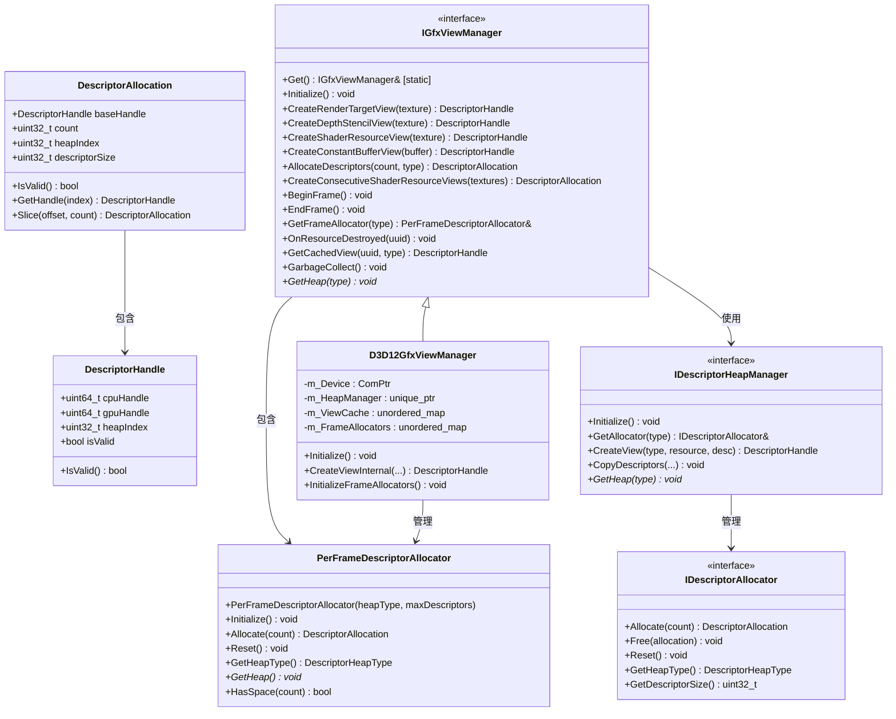

# Descriptor系统重构设计文档

## 一、概述

基于现有RHI层接口设计，Descriptor系统采用分层架构，提供了统一的跨平台抽象，支持高效的描述符分配和管理。系统通过清晰的接口分层，实现了描述符的创建、缓存、帧级管理和资源生命周期跟踪。

整体架构采用接口分离设计：
- **`DescriptorTypes.h`**: 定义核心数据结构和枚举类型
- **`IDescriptorAllocator`**: 底层描述符分配器接口
- **`IDescriptorHeapManager`**: 描述符堆管理器接口
- **`PerFrameDescriptorAllocator`**: 帧级临时描述符分配器
- **`IGfxViewManager`**: 高级视图管理器接口，提供统一的单例访问
- **`D3D12GfxViewManager`**: DirectX 12平台的具体实现



## 二、核心数据结构

### 1. 描述符类型定义

```cpp
// 描述符类型枚举
enum class DescriptorType {
    CBV,        // 常量缓冲区视图
    SRV,        // 着色器资源视图
    UAV,        // 无序访问视图
    Sampler,    // 采样器
    RTV,        // 渲染目标视图
    DSV         // 深度模板视图
};

// 描述符堆类型枚举
enum class DescriptorHeapType {
    CbvSrvUav,  // 组合堆
    Sampler,    // 采样器堆
    Rtv,        // 渲染目标堆
    Dsv         // 深度模板堆
};
```

### 2. 描述符句柄和分配

```cpp
// 平台无关的描述符句柄
struct DescriptorHandle {
    uint64_t cpuHandle = 0;    // CPU可访问句柄
    uint64_t gpuHandle = 0;    // GPU可访问句柄（若支持）
    uint32_t heapIndex = 0;    // 在堆中的索引
    bool     isValid = false;  // 是否有效
    
    bool IsValid() const { return isValid; }
};

// 描述符分配结果
struct DescriptorAllocation {
    DescriptorHandle baseHandle;  // 基础句柄
    uint32_t count = 0;           // 分配的描述符数量
    uint32_t heapIndex = 0;       // 所属堆的索引
    uint32_t descriptorSize = 0;  // 单个描述符的大小
    
    bool IsValid() const { return baseHandle.IsValid() && count > 0; }
    
    // 获取指定偏移量的句柄
    DescriptorHandle GetHandle(uint32_t index) const;
    
    // 从当前分配中切片出一部分
    DescriptorAllocation Slice(uint32_t offset, uint32_t newCount) const;
};
```

## 三、接口层设计

### 1. 描述符分配器接口 (`IDescriptorAllocator`)

```cpp
class IDescriptorAllocator {
public:
    virtual ~IDescriptorAllocator() = default;
    
    // 分配描述符
    virtual DescriptorAllocation Allocate(uint32_t count = 1) = 0;
    
    // 释放描述符
    virtual void Free(const DescriptorAllocation& allocation) = 0;
    
    // 重置分配器
    virtual void Reset() = 0;
    
    // 获取堆类型
    virtual DescriptorHeapType GetHeapType() const = 0;
    
    // 获取描述符大小
    virtual uint32_t GetDescriptorSize() const = 0;
};
```

### 2. 描述符堆管理器接口 (`IDescriptorHeapManager`)

```cpp
class IDescriptorHeapManager {
public:
    virtual ~IDescriptorHeapManager() = default;
    
    // 初始化
    virtual void Initialize() = 0;
    
    // 获取分配器
    virtual IDescriptorAllocator& GetAllocator(DescriptorHeapType type) = 0;
    
    // 创建特定类型的视图
    virtual DescriptorHandle CreateView(DescriptorType type, const void* resourcePtr, const void* viewDesc = nullptr) = 0;
    
    // 复制描述符
    virtual void CopyDescriptors(
        uint32_t numDescriptors,
        const DescriptorHandle* srcHandles,
        const DescriptorHandle& dstHandleStart) = 0;
    
    // 获取特定类型的堆
    virtual void* GetHeap(DescriptorHeapType type) const = 0;
};
```

### 3. 帧级描述符分配器 (`PerFrameDescriptorAllocator`)

```cpp
// 帧级临时描述符分配器 - 为单帧提供快速临时描述符分配
class PerFrameDescriptorAllocator {
public:
    PerFrameDescriptorAllocator(DescriptorHeapType heapType, uint32_t maxDescriptors = 1024);
    virtual ~PerFrameDescriptorAllocator() = default;

    // 初始化分配器
    virtual void Initialize() = 0;

    // 分配临时描述符（仅在当前帧有效）
    virtual DescriptorAllocation Allocate(uint32_t count = 1) = 0;

    // 为新帧重置分配器
    virtual void Reset() = 0;

    // 获取此分配器管理的堆类型
    DescriptorHeapType GetHeapType() const { return m_HeapType; }

    // 获取底层堆
    virtual void* GetHeap() const = 0;

    // 检查是否有足够空间
    virtual bool HasSpace(uint32_t count) const = 0;

protected:
    DescriptorHeapType m_HeapType;
    uint32_t m_MaxDescriptors;
    uint32_t m_CurrentOffset;
    uint32_t m_DescriptorSize;
};
```

### 4. 高级视图管理器接口 (`IGfxViewManager`)

```cpp
class IGfxViewManager {
public:
    virtual ~IGfxViewManager() = default;
    
    // 初始化
    virtual void Initialize() = 0;
    
    // 资源视图创建 - 传入资源对象，内部自动提取UUID并缓存
    virtual DescriptorHandle CreateRenderTargetView(const Ref<TextureBuffer>& texture) = 0;
    virtual DescriptorHandle CreateDepthStencilView(const Ref<TextureBuffer>& texture) = 0;
    virtual DescriptorHandle CreateShaderResourceView(const Ref<TextureBuffer>& texture) = 0;
    virtual DescriptorHandle CreateConstantBufferView(const Ref<ConstantBuffer>& buffer) = 0;
    
    // 连续描述符分配和创建
    virtual DescriptorAllocation AllocateDescriptors(uint32_t count, DescriptorHeapType type) = 0;
    virtual void CreateShaderResourceView(const Ref<TextureBuffer>& texture, const DescriptorHandle& targetHandle) = 0;
    virtual void CreateConstantBufferView(const Ref<ConstantBuffer>& buffer, const DescriptorHandle& targetHandle) = 0;
    
    // 批量连续视图创建
    virtual DescriptorAllocation CreateConsecutiveShaderResourceViews(
        const std::vector<Ref<TextureBuffer>>& textures) = 0;
    
    // 帧管理
    virtual void BeginFrame() = 0;
    virtual void EndFrame() = 0;
    virtual PerFrameDescriptorAllocator& GetFrameAllocator(DescriptorHeapType type) = 0;
    
    // 资源生命周期管理 - 统一使用UUID避免资源销毁问题
    virtual void OnResourceDestroyed(const boost::uuids::uuid& resourceId) = 0;
    virtual DescriptorHandle GetCachedView(const boost::uuids::uuid& resourceId, DescriptorType type) = 0;
    virtual void GarbageCollect() = 0;
    
    // 获取堆
    virtual void* GetHeap(DescriptorHeapType type) const = 0;
    
    // 单例访问 - 自动根据编译宏选择实现
    static IGfxViewManager& Get();
};
```

## 四、平台实现层

### 1. 单例实现机制

```cpp
// IGfxViewManager.cpp - 自动平台选择实现
IGfxViewManager& IGfxViewManager::Get() {
    std::lock_guard<std::mutex> lock(s_Mutex);
    
    if (!s_Instance) {
        // 根据当前渲染API创建适当的实现
#ifdef RENDER_API_DIRECTX12
        s_Instance = std::make_unique<D3D12GfxViewManager>();
#elif RENDER_API_OPENGL
        // TODO: 创建OpenGL实现
        HZ_CORE_ASSERT(false, "OpenGL GfxViewManager not implemented yet");
#else
        HZ_CORE_ASSERT(false, "Unknown render API");
#endif
        
        // 初始化实例
        s_Instance->Initialize();
    }
    
    return *s_Instance;
}
```

### 2. D3D12平台实现 (`D3D12GfxViewManager`)

```cpp
class D3D12GfxViewManager : public IGfxViewManager {
public:
    D3D12GfxViewManager();
    virtual ~D3D12GfxViewManager();

    // IGfxViewManager接口实现
    virtual void Initialize() override;
    
    // 资源视图创建 - 自动UUID提取和缓存
    virtual DescriptorHandle CreateRenderTargetView(const Ref<TextureBuffer>& texture) override;
    virtual DescriptorHandle CreateDepthStencilView(const Ref<TextureBuffer>& texture) override;
    virtual DescriptorHandle CreateShaderResourceView(const Ref<TextureBuffer>& texture) override;
    virtual DescriptorHandle CreateConstantBufferView(const Ref<ConstantBuffer>& buffer) override;
    
    // 连续描述符分配和创建
    virtual DescriptorAllocation AllocateDescriptors(uint32_t count, DescriptorHeapType type) override;
    virtual void CreateShaderResourceView(const Ref<TextureBuffer>& texture, const DescriptorHandle& targetHandle) override;
    virtual void CreateConstantBufferView(const Ref<ConstantBuffer>& buffer, const DescriptorHandle& targetHandle) override;
    
    // 批量连续视图创建
    virtual DescriptorAllocation CreateConsecutiveShaderResourceViews(
        const std::vector<Ref<TextureBuffer>>& textures) override;
    
    // 帧管理
    virtual void BeginFrame() override;  // 重置所有帧分配器
    virtual void EndFrame() override;    // 帧清理
    virtual PerFrameDescriptorAllocator& GetFrameAllocator(DescriptorHeapType type) override;
    
    // 资源生命周期管理
    virtual void OnResourceDestroyed(const boost::uuids::uuid& resourceId) override;  // 清理缓存
    virtual DescriptorHandle GetCachedView(const boost::uuids::uuid& resourceId, DescriptorType type) override;
    virtual void GarbageCollect() override;
    
    // 获取堆
    virtual void* GetHeap(DescriptorHeapType type) const override;

private:
    Microsoft::WRL::ComPtr<ID3D12Device> m_Device;
    
    // 不同描述符类型的堆管理器
    std::unique_ptr<IDescriptorHeapManager> m_HeapManager;
    
    // 缓存的视图用于资源重用 - 使用UUID避免销毁问题
    std::unordered_map<boost::uuids::uuid, std::unordered_map<DescriptorType, DescriptorHandle>, boost::hash<boost::uuids::uuid>> m_ViewCache;
    
    // 临时描述符的帧分配器
    std::unordered_map<DescriptorHeapType, std::unique_ptr<PerFrameDescriptorAllocator>> m_FrameAllocators;
    
    // 辅助函数
    DescriptorHandle CreateViewInternal(const void* resource, DescriptorType type, const void* viewDesc = nullptr);
    void InitializeFrameAllocators();
};
```

## 五、使用模式与示例

### 1. 基本使用模式

```cpp
void ExampleUsage() {
    // 获取单例实例 - 自动创建并注册适当的实现（比如D3D12GfxViewManager）
    IGfxViewManager& viewManager = IGfxViewManager::Get();
    
    // 创建一些纹理
    std::vector<Ref<TextureBuffer>> textures;
    for (int i = 0; i < 5; ++i) {
        TextureBufferSpecification spec = { 
            256, 256, 
            TextureType::TEXTURE2D, 
            TextureFormat::RGBA32, 
            TextureRenderUsage::RENDER_TEXTURE, 
            MultiSample::NONE 
        };
        textures.push_back(TextureBuffer::Create(spec));
    }
    
    // 分配连续描述符并创建SRV - 高效批量操作
    DescriptorAllocation textureViews = viewManager.CreateConsecutiveShaderResourceViews(textures);
    
    // 帧管理示例
    viewManager.BeginFrame();
    
    // 使用帧级分配器分配临时描述符
    auto& frameAllocator = viewManager.GetFrameAllocator(DescriptorHeapType::CbvSrvUav);
    DescriptorAllocation tempAllocation = frameAllocator.Allocate(10);
    
    // 在帧结束时清理
    viewManager.EndFrame();
    
    // 创建单个视图 - 自动缓存
    DescriptorHandle rtvHandle = viewManager.CreateRenderTargetView(textures[0]);
    DescriptorHandle srvHandle = viewManager.CreateShaderResourceView(textures[0]);
    
    // 从缓存获取视图 - 避免重复创建
    DescriptorHandle cachedView = viewManager.GetCachedView(textures[0]->GetUUID(), DescriptorType::SRV);
    
    // 垃圾回收
    viewManager.GarbageCollect();
}
```

### 2. 固定资源模式（高性能）

适用于资源组合固定的场景，如材质系统：

```cpp
// 材质初始化
void Material::Initialize() {
    // 获取材质需要的所有纹理
    std::vector<Ref<TextureBuffer>> textures = { m_AlbedoMap, m_NormalMap, m_RoughnessMap };
    
    // 分配连续描述符并创建SRV - 一次分配，多次使用
    m_TextureViews = IGfxViewManager::Get().CreateConsecutiveShaderResourceViews(textures);
}

// 材质绑定
void Material::Bind(CommandList* cmdList) {
    // 一次性绑定所有纹理（高效）
    cmdList->SetGraphicsRootDescriptorTable(1, m_TextureViews.baseHandle.gpuHandle);
}
```

### 3. 动态资源模式（灵活）

适用于需要频繁切换资源的场景：

```cpp
// 处理动态材质绘制
void RenderSystem::ProcessMaterialDrawCall(Material* material, CommandList* cmdList) {
    auto& viewManager = IGfxViewManager::Get();
    auto& textures = material->GetTextures();
    
    // 从帧分配器获取临时空间
    auto& frameAllocator = viewManager.GetFrameAllocator(DescriptorHeapType::CbvSrvUav);
    auto allocation = frameAllocator.Allocate(textures.size());
    
    // 复制已有描述符到临时空间
    std::vector<DescriptorHandle> srcHandles;
    for (auto& texture : textures) {
        srcHandles.push_back(viewManager.GetCachedView(texture->GetUUID(), DescriptorType::SRV));
    }
    
    // 复制描述符
    viewManager.GetHeapManager().CopyDescriptors(
        textures.size(),
        srcHandles.data(),
        allocation.baseHandle
    );
    
    // 绑定描述符表并绘制
    cmdList->SetGraphicsRootDescriptorTable(0, allocation.baseHandle.gpuHandle);
    cmdList->DrawIndexed(material->GetIndexCount(), 1, 0, 0, 0);
}
```

## 六、架构特性与优势

### 1. 核心特性

1. **单例模式与自动平台选择**: `IGfxViewManager::Get()`自动根据编译宏选择合适的平台实现
2. **UUID资源追踪**: 使用`boost::uuids::uuid`进行资源生命周期管理，避免悬空指针
3. **视图缓存机制**: 自动缓存创建的描述符视图，避免重复创建
4. **帧级临时分配**: `PerFrameDescriptorAllocator`提供高效的临时描述符分配
5. **连续描述符支持**: 支持批量连续描述符分配，优化描述符表使用
6. **接口分层设计**: 清晰的接口层次，便于扩展和维护

### 2. 设计优势

1. **高性能**: 
   - 连续描述符分配减少绑定次数
   - 视图缓存避免重复创建开销
   - 帧级分配器提供O(1)临时分配

2. **内存安全**:
   - UUID追踪避免资源销毁问题
   - 智能指针管理生命周期
   - 自动垃圾回收机制

3. **跨平台抽象**:
   - 统一的接口层隐藏平台差异
   - 编译时平台选择
   - 易于扩展新的图形API

4. **易用性**:
   - 单例模式简化访问
   - 自动资源管理
   - 丰富的使用模式支持

## 七、实现状态

当前实现基于已有的RHI接口设计，主要组件包括：

### 已实现接口
- ✅ `DescriptorTypes.h` - 核心数据结构和枚举
- ✅ `IDescriptorAllocator.h` - 分配器接口和数据结构
- ✅ `IDescriptorHeapManager.h` - 堆管理器接口
- ✅ `PerFrameDescriptorAllocator.h` - 帧级分配器接口
- ✅ `IGfxViewManager.h/.cpp` - 主要视图管理器接口和单例实现
- ✅ `D3D12GfxViewManager.h/.cpp` - DirectX12平台实现框架
- ✅ `ViewManagerExample.cpp` - 使用示例

### 待完善功能
- 🔄 D3D12平台具体实现细节（当前为TODO占位符）
- 🔄 OpenGL平台实现
- 🔄 描述符堆的实际分配和管理逻辑
- 🔄 帧级分配器的具体实现

该架构为Hazel引擎提供了一个可扩展、高性能的描述符管理系统，支持现代渲染管线的需求。
