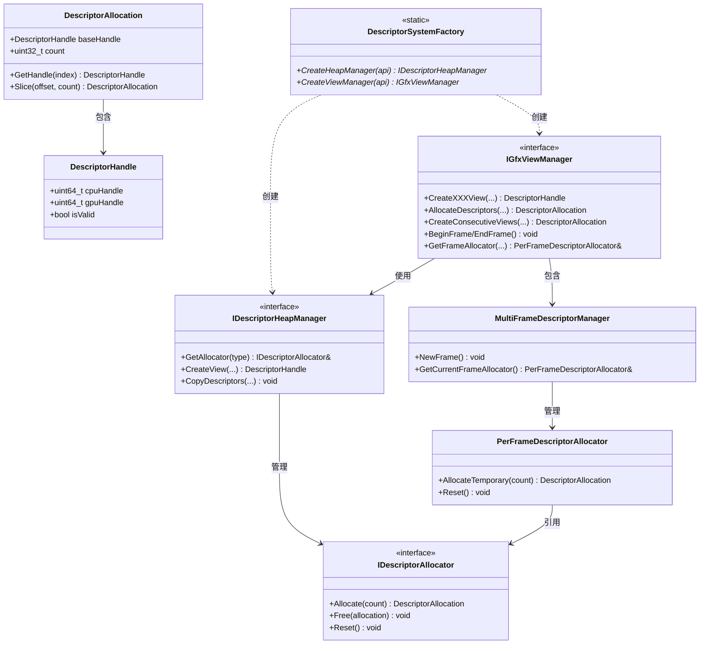

# Descriptor系统重构计划

## 一、概述

重构后的Descriptor系统采用分层设计，主要目标是解决当前系统在连续描述符分配、资源生命周期管理和跨平台抽象方面的不足。新系统通过提供连续描述符的高效分配和管理，支持描述符表优化，并增强了资源追踪和多线程安全性。

整体架构设计如下：
最底层有一个HeapManager，根据上层的DescriptorAllocation以及 DescriptorHandle，去真实的创建描述符，并且将GPU Handle等数据保存在DescriptorHandle里面。
ViewManager负责上层调用，用来连接上层的各种访问，支持接口，比如创建一个或者一堆连续的descriptor。
ViewManager持有一个MultiFrameDescriptorManager，来管理多帧需要的临时描述符，这些描述符已经被预创建，只需要copy到临时的渲染专用descriptor中就行了。



## 二、当前系统问题与解决方案

### 现有问题
1. **连续性问题**: 缺乏对描述符的连续分配管理，降低了描述符表使用效率
2. **资源追踪**: 没有完善的资源生命周期管理机制
3. **堆管理**: 描述符堆大小固定(10)，缺乏动态扩展能力
4. **内存碎片**: 缺少对描述符空间的回收和再利用机制
5. **多线程安全**: 当前实现不是线程安全的
6. **缓存一致性**: 缺乏帧间缓存管理机制
7. **平台抽象**: 部分接口直接依赖于特定API (DirectX12)，缺乏统一的抽象层

### 解决方案
1. **分层架构**: 将系统分为数据结构层、内存管理层、高级资源管理层和平台抽象层
2. **连续描述符分配**: 实现DescriptorAllocation支持连续空间分配和切片
3. **资源生命周期管理**: 在ViewManager中实现资源与描述符的映射和回收
4. **帧级临时分配器**: 通过环形缓冲区优化每帧临时资源的分配
5. **多线程保护**: 添加互斥锁保护共享资源的访问
6. **工厂模式**: 实现跨平台抽象，隔离平台特定实现

## 三、新架构设计

### 1. 数据结构层

#### 描述符类型
```cpp
enum class DescriptorType {
    CBV,        // 常量缓冲区视图
    SRV,        // 着色器资源视图
    UAV,        // 无序访问视图
    Sampler,    // 采样器
    RTV,        // 渲染目标视图
    DSV         // 深度模板视图
};

enum class DescriptorHeapType {
    CbvSrvUav,  // 组合堆
    Sampler,    // 采样器堆
    Rtv,        // 渲染目标堆
    Dsv         // 深度模板堆
};
```

#### 描述符句柄和分配

```cpp
// 平台无关的描述符句柄
struct DescriptorHandle {
    uint64_t cpuHandle = 0;  // CPU可访问句柄
    uint64_t gpuHandle = 0;  // GPU可访问句柄（若支持）
    uint32_t heapIndex = 0;  // 在堆中的索引
    bool     isValid = false; // 是否有效
    
    bool IsValid() const { return isValid; }
};

// 描述符分配结果
struct DescriptorAllocation {
    DescriptorHandle baseHandle;  // 基础句柄
    uint32_t count = 0;           // 分配的描述符数量
    uint32_t heapIndex = 0;       // 所属堆的索引
    uint32_t descriptorSize = 0;  // 单个描述符的大小
    
    bool IsValid() const { return baseHandle.IsValid() && count > 0; }
    
    // 获取指定偏移量的句柄
    DescriptorHandle GetHandle(uint32_t index) const;
    
    // 从当前分配中切片出一部分
    DescriptorAllocation Slice(uint32_t offset, uint32_t newCount) const;
};
```

### 2. 内存管理层

#### 描述符分配器
```cpp
class IDescriptorAllocator {
public:
    virtual ~IDescriptorAllocator() = default;
    
    // 分配描述符
    virtual DescriptorAllocation Allocate(uint32_t count = 1) = 0;
    
    // 释放描述符
    virtual void Free(const DescriptorAllocation& allocation) = 0;
    
    // 重置分配器
    virtual void Reset() = 0;
    
    // 获取堆类型
    virtual DescriptorHeapType GetHeapType() const = 0;
    
    // 获取描述符大小
    virtual uint32_t GetDescriptorSize() const = 0;
};
```

#### 描述符堆管理器
```cpp
class IDescriptorHeapManager {
public:
    virtual ~IDescriptorHeapManager() = default;
    
    // 初始化
    virtual void Initialize() = 0;
    
    // 获取分配器
    virtual IDescriptorAllocator& GetAllocator(DescriptorHeapType type) = 0;
    
    // 创建特定类型的视图
    virtual DescriptorHandle CreateView(DescriptorType type, const void* resourcePtr, const void* viewDesc = nullptr) = 0;
    
    // 复制描述符
    virtual void CopyDescriptors(
        uint32_t numDescriptors,
        const DescriptorHandle* srcHandles,
        const DescriptorHandle& dstHandleStart) = 0;
    
    // 获取特定类型的堆
    virtual void* GetHeap(DescriptorHeapType type) const = 0;
};
```

### 3. 高级资源管理层

#### 视图管理器
```cpp
class IGfxViewManager {
public:
    virtual ~IGfxViewManager() = default;
    
    // 初始化
    virtual void Initialize() = 0;
    
    // 资源视图创建（非连续）
    virtual DescriptorHandle CreateRenderTargetView(const Ref<TextureBuffer>& texture) = 0;
    virtual DescriptorHandle CreateDepthStencilView(const Ref<TextureBuffer>& texture) = 0;
    virtual DescriptorHandle CreateShaderResourceView(const Ref<TextureBuffer>& texture) = 0;
    virtual DescriptorHandle CreateConstantBufferView(const Ref<ConstantBuffer>& buffer) = 0;
    
    // 连续描述符分配和创建
    virtual DescriptorAllocation AllocateDescriptors(uint32_t count, DescriptorHeapType type) = 0;
    virtual void CreateShaderResourceView(const Ref<TextureBuffer>& texture, const DescriptorHandle& targetHandle) = 0;
    virtual void CreateConstantBufferView(const Ref<ConstantBuffer>& buffer, const DescriptorHandle& targetHandle) = 0;
    
    // 批量连续视图创建
    virtual DescriptorAllocation CreateConsecutiveShaderResourceViews(
        const std::vector<Ref<TextureBuffer>>& textures) = 0;
    
    // 帧管理
    virtual void BeginFrame() = 0;
    virtual void EndFrame() = 0;
    virtual PerFrameDescriptorAllocator& GetFrameAllocator(DescriptorHeapType type) = 0;
    
    // 资源生命周期管理
    virtual void OnResourceDestroyed(const boost::uuids::uuid& resourceId) = 0;
    virtual DescriptorHandle GetCachedView(const boost::uuids::uuid& resourceId, DescriptorType type) = 0;
    virtual void GarbageCollect() = 0;
    
    // 获取堆
    virtual void* GetHeap(DescriptorHeapType type) const = 0;
    
    // 单例访问
    static IGfxViewManager& Get();
};
```

#### 帧级临时描述符分配器
```cpp
class PerFrameDescriptorAllocator {
public:
    // 构造函数，预分配环形缓冲区
    PerFrameDescriptorAllocator(IDescriptorAllocator& allocator, uint32_t ringBufferSize);
    
    // 从环形缓冲区分配临时描述符
    DescriptorAllocation AllocateTemporary(uint32_t count);
    
    // 每帧开始时重置
    void Reset();
    
private:
    IDescriptorAllocator& m_Allocator;
    DescriptorAllocation m_RingBufferAllocation;
    uint32_t m_CurrentOffset = 0;
    uint32_t m_RingBufferSize;
    std::mutex m_Mutex;
};
```

#### 多帧描述符管理器
```cpp
class MultiFrameDescriptorManager {
public:
    // 构造函数，指定帧缓冲数量
    MultiFrameDescriptorManager(uint32_t frameCount = 3);
    
    // 初始化帧分配器
    void Initialize(IDescriptorHeapManager* heapManager, uint32_t allocationsPerFrame = 1024);
    
    // 切换到下一帧
    void NewFrame();
    
    // 获取当前帧的分配器
    PerFrameDescriptorAllocator& GetCurrentFrameAllocator();
    
private:
    std::vector<std::unique_ptr<PerFrameDescriptorAllocator>> m_FrameAllocators;
    uint32_t m_FrameCount = 3;
    uint32_t m_CurrentFrame = 0;
};
```

### 4. 工厂和平台抽象层

```cpp
class DescriptorSystemFactory {
public:
    // 创建适合当前API的堆管理器
    static Scope<IDescriptorHeapManager> CreateHeapManager(GraphicsAPI api);
    
    // 创建适合当前API的视图管理器
    static Scope<IGfxViewManager> CreateViewManager(GraphicsAPI api);
};
```

## 四、使用模式

### 1. 固定资源模式（高性能）

适用于资源组合固定的场景，如材质系统。预分配连续描述符，一次绑定多个资源。

```cpp
// 材质初始化
void Material::Initialize() {
    // 获取材质需要的所有纹理
    std::vector<Ref<TextureBuffer>> textures = { m_AlbedoMap, m_NormalMap, m_RoughnessMap };
    
    // 分配连续描述符并创建SRV
    m_TextureViews = IGfxViewManager::Get().CreateConsecutiveShaderResourceViews(textures);
}

// 材质绑定
void Material::Bind(CommandList* cmdList) {
    // 一次性绑定所有纹理（高效）
    cmdList->SetGraphicsRootDescriptorTable(1, m_TextureViews.baseHandle.gpuHandle);
}
```

### 2. 动态资源模式（灵活）

适用于需要频繁切换资源的场景。利用帧分配器获取临时描述符空间。

```cpp
// 处理动态材质绘制
void RenderSystem::ProcessMaterialDrawCall(Material* material, CommandList* cmdList) {
    // 获取材质纹理
    auto& textures = material->GetTextures();
    
    // 从帧分配器获取临时空间
    auto& frameAllocator = IGfxViewManager::Get().GetFrameAllocator(DescriptorHeapType::CbvSrvUav);
    auto allocation = frameAllocator.AllocateTemporary(textures.size());
    
    // 复制已有描述符到临时空间
    std::vector<DescriptorHandle> srcHandles;
    for (auto& texture : textures) {
        srcHandles.push_back(IGfxViewManager::Get().GetCachedView(texture->GetUUID(), DescriptorType::SRV));
    }
    
    IGfxViewManager::Get().GetHeapManager().CopyDescriptors(
        textures.size(),
        srcHandles.data(),
        allocation.baseHandle
    );
    
    // 绑定描述符表并绘制
    cmdList->SetGraphicsRootDescriptorTable(0, allocation.baseHandle.gpuHandle);
    cmdList->DrawIndexed(material->GetIndexCount(), 1, 0, 0, 0);
}
```

## 五、架构初始化

```cpp
void Renderer::InitializeDescriptorSystem() {
    // 获取当前图形API类型
    GraphicsAPI api = GraphicsDevice::Get().GetGraphicsAPI();
    
    // 使用工厂创建适合当前API的描述符系统
    m_DescriptorHeapManager = DescriptorSystemFactory::CreateHeapManager(api);
    m_ViewManager = DescriptorSystemFactory::CreateViewManager(api);
    
    // 初始化描述符堆管理器
    DescriptorHeapConfig heapConfig;
    heapConfig.cbvSrvUavHeapSize = 5000;  // 默认大小
    heapConfig.samplerHeapSize = 1000;
    heapConfig.rtvHeapSize = 100;
    heapConfig.dsvHeapSize = 100;
    
    m_DescriptorHeapManager->Initialize(heapConfig);
    
    // 初始化视图管理器
    m_ViewManager->Initialize(m_DescriptorHeapManager.get());
    
    // 注册资源销毁回调
    ResourceManager::Get().RegisterResourceDestroyedCallback(
        [this](const boost::uuids::uuid& resourceId) {
            m_ViewManager->OnResourceDestroyed(resourceId);
        }
    );
}
```

## 六、总结

重构后的描述符系统具有以下优势：

1. **连续描述符分配**：支持高效的描述符表操作
2. **帧级临时描述符**：优化了每帧临时资源的分配与回收
3. **资源生命周期管理**：完善了资源与描述符的映射和回收机制
4. **多线程安全**：添加了线程保护机制
5. **平台抽象**：提供了与平台无关的统一接口

新系统既支持高性能的静态资源绑定（固定资源模式），也支持灵活的动态资源管理（动态资源模式），为渲染系统提供了高效的资源管理机制。
