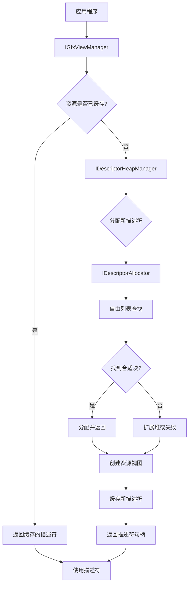
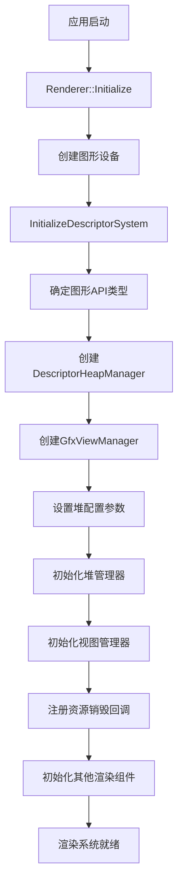

# Descriptor系统重构计划
## 大致思路：
DescritorAllocator是一个描述符分配器，它返回一个DescriptorAllocation，用来记录分配的结果。
DescritorAllocator分配时，只需要传入我需要分配几个描述符。
在DescriptorAllocation中， 记录一个DescritorHandle和一个count信息。
DescriptorHandle记录这个Handle的GPU和CPU地址。


## 一、当前描述符系统分析

### 1.1 现有架构
当前描述符系统采用以下类管理：
- `GfxDesc`: 表示单个描述符，包含CPU和GPU句柄
- `GfxDescHeap`: 管理描述符堆，负责创建和获取描述符
- `GfxViewManager`: 单例模式，管理不同类型的描述符堆和视图获取

### 1.2 现有问题
1. **连续性问题**: 缺乏对描述符的连续分配管理，导致在使用`SetGraphicsRootDescriptorTable`时效率低下
2. **资源追踪**: 没有完善的资源生命周期管理机制
3. **堆管理**: 描述符堆大小固定(10)，缺乏动态扩展能力
4. **内存碎片**: 缺少对描述符空间的回收和再利用机制
5. **多线程安全**: 当前实现不是线程安全的
6. **缓存一致性**: 缺乏帧间缓存管理机制
7. **平台抽象**: 部分接口直接依赖于特定API (DirectX12)，缺乏统一的抽象层

## 二、描述符系统重构设计

### 2.1 描述符系统抽象接口

#### 2.1.1 描述符类型枚举

```cpp
enum class DescriptorType {
    CBV,        // 常量缓冲区视图
    SRV,        // 着色器资源视图
    UAV,        // 无序访问视图
    Sampler,    // 采样器
    RTV,        // 渲染目标视图
    DSV         // 深度模板视图
};

enum class DescriptorHeapType {
    CbvSrvUav,  // 组合堆
    Sampler,    // 采样器堆
    Rtv,        // 渲染目标堆
    Dsv         // 深度模板堆
};
```

#### 2.1.2 描述符句柄

```cpp
// 平台无关的描述符句柄
struct DescriptorHandle {
    uint64_t cpuHandle = 0;  // CPU可访问句柄
    uint64_t gpuHandle = 0;  // GPU可访问句柄（若支持）
    uint32_t heapIndex = 0;  // 在堆中的索引
    bool     isValid = false; // 是否有效
    
    bool IsValid() const { return isValid; }
};
```

#### 2.1.3 描述符分配结果

```cpp
struct DescriptorAllocation {
    DescriptorHandle baseHandle;  // 基础句柄
    uint32_t count = 0;           // 分配的描述符数量
    uint32_t heapIndex = 0;       // 所属堆的索引
    
    bool IsValid() const { return baseHandle.IsValid() && count > 0; }
};
```

#### 2.1.4 描述符分配器接口

```cpp
class IDescriptorAllocator {
public:
    virtual ~IDescriptorAllocator() = default;
    
    // 分配描述符
    virtual DescriptorAllocation Allocate(uint32_t count = 1) = 0;
    
    // 释放描述符
    virtual void Free(const DescriptorAllocation& allocation) = 0;
    
    // 重置分配器
    virtual void Reset() = 0;
    
    // 获取堆类型
    virtual DescriptorHeapType GetHeapType() const = 0;
    
    // 获取描述符大小
    virtual uint32_t GetDescriptorSize() const = 0;
};
```

#### 2.1.5 描述符堆管理器接口

```cpp
class IDescriptorHeapManager {
public:
    virtual ~IDescriptorHeapManager() = default;
    
    // 初始化
    virtual void Initialize() = 0;
    
    // 获取分配器
    virtual IDescriptorAllocator& GetAllocator(DescriptorHeapType type) = 0;
    
    // 创建特定类型的视图
    virtual DescriptorHandle CreateView(DescriptorType type, const void* resourcePtr, const void* viewDesc = nullptr) = 0;
    
    // 复制描述符
    virtual void CopyDescriptors(
        uint32_t numDescriptors,
        const DescriptorHandle& srcHandleStart,
        const DescriptorHandle& dstHandleStart) = 0;
    
    // 获取特定类型的堆
    virtual void* GetHeap(DescriptorHeapType type) const = 0;
};
```

### 2.2 DirectX12实现

#### 2.2.1 DirectX12描述符分配器

```cpp
class D3D12DescriptorAllocator : public IDescriptorAllocator {
public:
    D3D12DescriptorAllocator(ID3D12Device* device, D3D12_DESCRIPTOR_HEAP_TYPE type, uint32_t numDescriptors, bool isShaderVisible);
    virtual ~D3D12DescriptorAllocator();
    
    // IDescriptorAllocator接口实现
    virtual DescriptorAllocation Allocate(uint32_t count = 1) override;
    virtual void Free(const DescriptorAllocation& allocation) override;
    virtual void Reset() override;
    virtual DescriptorHeapType GetHeapType() const override;
    virtual uint32_t GetDescriptorSize() const override;
    
    // D3D12特定方法
    ID3D12DescriptorHeap* GetD3D12DescriptorHeap() const { return m_Heap.Get(); }
    
private:
    Microsoft::WRL::ComPtr<ID3D12DescriptorHeap> m_Heap;
    D3D12_DESCRIPTOR_HEAP_TYPE m_D3D12HeapType;
    DescriptorHeapType m_HeapType;
    uint32_t m_DescriptorSize;
    uint32_t m_NumDescriptorsInHeap;
    bool m_IsShaderVisible;
    
    // 自由列表管理
    std::vector<std::pair<uint32_t, uint32_t>> m_FreeList; // offset, count
    std::mutex m_Mutex;
    
    // 辅助方法
    D3D12_CPU_DESCRIPTOR_HANDLE GetCPUDescriptorHandleForHeapStart() const;
    D3D12_GPU_DESCRIPTOR_HANDLE GetGPUDescriptorHandleForHeapStart() const;
    
    // 将平台特定句柄转换为抽象句柄
    DescriptorHandle CreateDescriptorHandle(uint32_t index) const;
};
```

#### 2.2.2 DirectX12堆管理器

```cpp
class D3D12DescriptorHeapManager : public IDescriptorHeapManager {
public:
    static D3D12DescriptorHeapManager& Get();
    
    // IDescriptorHeapManager接口实现
    virtual void Initialize() override;
    virtual IDescriptorAllocator& GetAllocator(DescriptorHeapType type) override;
    virtual DescriptorHandle CreateView(DescriptorType type, const void* resourcePtr, const void* viewDesc = nullptr) override;
    virtual void CopyDescriptors(uint32_t numDescriptors, const DescriptorHandle& srcHandleStart, const DescriptorHandle& dstHandleStart) override;
    virtual void* GetHeap(DescriptorHeapType type) const override;
    
    // D3D12特定方法
    ID3D12DescriptorHeap* GetCbvSrvUavHeap() const;
    ID3D12DescriptorHeap* GetSamplerHeap() const;
    ID3D12DescriptorHeap* GetRtvHeap() const;
    ID3D12DescriptorHeap* GetDsvHeap() const;
    
private:
    std::unique_ptr<D3D12DescriptorAllocator> m_CbvSrvUavAllocator;
    std::unique_ptr<D3D12DescriptorAllocator> m_SamplerAllocator;
    std::unique_ptr<D3D12DescriptorAllocator> m_RtvAllocator;
    std::unique_ptr<D3D12DescriptorAllocator> m_DsvAllocator;
    ID3D12Device* m_Device;
    
    // 转换方法
    D3D12_DESCRIPTOR_HEAP_TYPE ConvertToD3D12HeapType(DescriptorHeapType type) const;
    D3D12_CPU_DESCRIPTOR_HANDLE ConvertToCpuHandle(const DescriptorHandle& handle) const;
    D3D12_GPU_DESCRIPTOR_HANDLE ConvertToGpuHandle(const DescriptorHandle& handle) const;
};
```

### 2.3 GfxViewManager重构

#### 2.3.1 视图管理器接口

```cpp
class IGfxViewManager {
public:
    virtual ~IGfxViewManager() = default;
    
    // 初始化
    virtual void Initialize() = 0;
    
    // 创建/获取视图
    virtual DescriptorHandle CreateRenderTargetView(const Ref<TextureBuffer>& texture) = 0;
    virtual DescriptorHandle CreateDepthStencilView(const Ref<TextureBuffer>& texture) = 0;
    virtual DescriptorHandle CreateShaderResourceView(const Ref<TextureBuffer>& texture) = 0;
    virtual DescriptorHandle CreateConstantBufferView(const Ref<ConstantBuffer>& buffer) = 0;
    
    // 批量创建连续的常量缓冲区视图
    virtual DescriptorAllocation CreateConsecutiveConstantBufferViews(
        const std::vector<Ref<ConstantBuffer>>& buffers) = 0;
    
    // 内部缓存查找
    virtual DescriptorHandle GetCachedView(const boost::uuids::uuid& resourceId, DescriptorType type) = 0;
    
    // 获取特定类型的堆
    virtual void* GetHeap(DescriptorHeapType type) const = 0;
    
    // 清理无效资源
    virtual void GarbageCollect() = 0;
};
```

#### 2.3.2 DirectX12视图管理器实现

```cpp
class D3D12GfxViewManager : public IGfxViewManager {
public:
    static D3D12GfxViewManager& Get();
    
    // IGfxViewManager接口实现
    virtual void Initialize() override;
    virtual DescriptorHandle CreateRenderTargetView(const Ref<TextureBuffer>& texture) override;
    virtual DescriptorHandle CreateDepthStencilView(const Ref<TextureBuffer>& texture) override;
    virtual DescriptorHandle CreateShaderResourceView(const Ref<TextureBuffer>& texture) override;
    virtual DescriptorHandle CreateConstantBufferView(const Ref<ConstantBuffer>& buffer) override;
    virtual DescriptorAllocation CreateConsecutiveConstantBufferViews(
        const std::vector<Ref<ConstantBuffer>>& buffers) override;
    virtual DescriptorHandle GetCachedView(const boost::uuids::uuid& resourceId, DescriptorType type) override;
    virtual void* GetHeap(DescriptorHeapType type) const override;
    virtual void GarbageCollect() override;
    
private:
    D3D12DescriptorHeapManager& m_HeapManager;
    
    // 资源缓存
    std::unordered_map<boost::uuids::uuid, DescriptorHandle> m_RtvCache;
    std::unordered_map<boost::uuids::uuid, DescriptorHandle> m_DsvCache;
    std::unordered_map<boost::uuids::uuid, DescriptorHandle> m_SrvCache;
    std::unordered_map<boost::uuids::uuid, DescriptorHandle> m_CbvCache;
    
    // 批量描述符分配缓存
    std::unordered_map<size_t, DescriptorAllocation> m_BatchAllocationCache;
    
    std::mutex m_Mutex;
    
    // 辅助方法
    void CreateDescriptorIfNeeded(const boost::uuids::uuid& resourceId, const Ref<TextureBuffer>& texture, DescriptorType type);
    void CreateCbvDescriptorIfNeeded(const boost::uuids::uuid& resourceId, const Ref<ConstantBuffer>& buffer);
    
    // 创建批量描述符的哈希ID
    size_t CreateBatchId(const std::vector<boost::uuids::uuid>& resourceIds);
};
```

### 2.4 描述符分配自由列表算法

```cpp
// 在D3D12DescriptorAllocator中实现
DescriptorAllocation D3D12DescriptorAllocator::Allocate(uint32_t count) {
    // 加锁保证线程安全
    std::lock_guard<std::mutex> lock(m_Mutex);
    
    // 查找足够大的空闲块
    auto it = std::find_if(m_FreeList.begin(), m_FreeList.end(),
        [count](const std::pair<uint32_t, uint32_t>& block) {
            return block.second >= count;
        });
    
    if (it == m_FreeList.end()) {
        // 没有足够大的块，分配失败
        return DescriptorAllocation{};
    }
    
    // 找到合适的块
    uint32_t offset = it->first;
    uint32_t blockSize = it->second;
    
    // 更新空闲列表
    if (blockSize == count) {
        // 刚好填满，移除此块
        m_FreeList.erase(it);
    } else {
        // 块比需要的大，分割块
        it->first = offset + count;
        it->second = blockSize - count;
    }
    
    // 创建分配结果
    DescriptorAllocation allocation;
    allocation.baseHandle = CreateDescriptorHandle(offset);
    allocation.count = count;
    allocation.heapIndex = m_HeapType;
    
    return allocation;
}

void D3D12DescriptorAllocator::Free(const DescriptorAllocation& allocation) {
    if (!allocation.IsValid()) {
        return;
    }
    
    std::lock_guard<std::mutex> lock(m_Mutex);
    
    // 获取偏移量
    uint32_t offset = allocation.baseHandle.heapIndex;
    uint32_t count = allocation.count;
    
    // 查找合适的位置插入，保持按偏移量排序
    auto it = std::lower_bound(m_FreeList.begin(), m_FreeList.end(), offset,
        [](const std::pair<uint32_t, uint32_t>& block, uint32_t offsetToInsert) {
            return block.first < offsetToInsert;
        });
    
    // 检查前一个块，可能可以合并
    if (it != m_FreeList.begin()) {
        auto prev = std::prev(it);
        if (prev->first + prev->second == offset) {
            // 可以与前一个块合并
            prev->second += count;
            
            // 检查是否也可以与后一个块合并
            if (it != m_FreeList.end() && offset + count == it->first) {
                prev->second += it->second;
                m_FreeList.erase(it);
            }
            return;
        }
    }
    
    // 检查后一个块，可能可以合并
    if (it != m_FreeList.end() && offset + count == it->first) {
        // 可以与后一个块合并
        uint32_t newOffset = offset;
        uint32_t newSize = count + it->second;
        it->first = newOffset;
        it->second = newSize;
        return;
    }
    
    // 不能合并，插入新块
    m_FreeList.insert(it, std::make_pair(offset, count));
}
```

## 三、描述符系统实现步骤

### 3.1 基础接口实现

1. **定义平台无关的枚举和结构**
   - 实现`DescriptorType`和`DescriptorHeapType`枚举
   - 实现`DescriptorHandle`和`DescriptorAllocation`结构

2. **创建基础接口类**
   - 实现`IDescriptorAllocator`接口
   - 实现`IDescriptorHeapManager`接口
   - 实现`IGfxViewManager`接口

### 3.2 DirectX12实现

1. **描述符分配器**
   - 实现`D3D12DescriptorAllocator`类
   - 实现自由列表分配算法
   - 添加线程安全机制

2. **堆管理器**
   - 实现`D3D12DescriptorHeapManager`类
   - 配置不同类型的堆
   - 实现描述符创建和复制功能

3. **视图管理器**
   - 实现`D3D12GfxViewManager`类
   - 实现资源视图缓存管理
   - 实现垃圾回收机制

### 3.3 工厂和辅助功能

1. **工厂类实现**
   - 实现`GfxFactory`用于创建正确的平台实现
   - 添加API检测和选择逻辑

2. **工具函数**
   - 实现平台特定句柄与抽象句柄的转换
   - 实现描述符大小计算工具

3. **调试辅助**
   - 添加描述符跟踪和统计功能
   - 实现验证和错误检查

### 3.4 单元测试

1. **分配器测试**
   - 测试描述符分配和释放
   - 测试内存碎片整理
   - 测试多线程安全性

2. **缓存测试**
   - 测试视图缓存命中率
   - 测试资源生命周期管理
   - 测试垃圾回收

## 四、与其他系统的接口

### 4.1 与MaterialBatchManager的接口

```cpp
// MaterialBatchManager需要描述符系统提供的接口
class IMaterialBatchManager {
public:
    // 初始化时需要的接口
    virtual void Initialize(IDescriptorHeapManager* heapManager) = 0;
    
    // 注册材质时需要的接口
    virtual MaterialBatchInfo RegisterMaterial(const Ref<Material>& material) = 0;
    
    // 这个接口会使用描述符系统
    virtual void SetMaterialState(void* cmdList, const MaterialBatchInfo& info) = 0;
};
```

### 4.2 与DrawCommand的接口

```cpp
// DrawCommand需要描述符系统提供的接口
class IDrawCommandList {
public:
    // 初始化时需要的接口
    virtual void Initialize(IGfxViewManager* viewManager) = 0;
    
    // 执行绘制命令时会使用描述符系统
    virtual void Execute(void* cmdList) = 0;
};
```

## 五、描述符系统架构图

```mermaid
classDiagram
    class IDescriptorAllocator {
        <<interface>>
        +Allocate(count) DescriptorAllocation
        +Free(allocation) void
        +Reset() void
        +GetHeapType() DescriptorHeapType
        +GetDescriptorSize() uint32_t
    }z`
    
    class D3D12DescriptorAllocator {
        -m_Heap : ID3D12DescriptorHeap*
        -m_FreeList : vector
        +Allocate(count) DescriptorAllocation
        +Free(allocation) void
        +Reset() void
    }
    
    class IDescriptorHeapManager {
        <<interface>>
        +Initialize() void
        +GetAllocator(type) IDescriptorAllocator&
        +CreateView(type, resource, desc) DescriptorHandle
        +CopyDescriptors(count, src, dst) void
    }
    
    class D3D12DescriptorHeapManager {
        -m_Allocators : array
        +Initialize() void
        +GetAllocator(type) IDescriptorAllocator&
        +CreateView(type, resource, desc) DescriptorHandle
    }
    
    class IGfxViewManager {
        <<interface>>
        +Initialize() void
        +CreateRenderTargetView(texture) DescriptorHandle
        +CreateShaderResourceView(texture) DescriptorHandle
        +CreateConstantBufferView(buffer) DescriptorHandle
    }
    
    class D3D12GfxViewManager {
        -m_HeapManager : D3D12DescriptorHeapManager
        -m_SrvCache : map
        +Initialize() void
        +CreateShaderResourceView(texture) DescriptorHandle
    }
    
    IDescriptorAllocator <|-- D3D12DescriptorAllocator
    IDescriptorHeapManager <|-- D3D12DescriptorHeapManager
    IGfxViewManager <|-- D3D12GfxViewManager
    
    D3D12DescriptorHeapManager o-- D3D12DescriptorAllocator
    D3D12GfxViewManager o-- D3D12DescriptorHeapManager
    
    class IMaterialBatchManager {
        <<interface>>
        +Initialize(heapManager) void
        +RegisterMaterial(material) MaterialBatchInfo
    }
    
    IGfxViewManager --> IMaterialBatchManager : 提供描述符服务
```

## 六、描述符系统流程图



## 七、应用层初始化设计

### 7.1 Renderer初始化时的描述符系统创建

```cpp
// 在Renderer类的Initialize方法中初始化描述符系统
class Renderer {
public:
    static void Initialize() {
        // 创建图形设备和命令队列
        GraphicsDevice::CreateInstance();
        
        // 创建并初始化描述符系统
        InitializeDescriptorSystem();
        
        // 初始化其他渲染系统组件
        // ...
    }

private:
    static void InitializeDescriptorSystem() {
        // 获取当前图形API类型
        GraphicsAPI api = GraphicsDevice::Get().GetGraphicsAPI();
        
        // 使用工厂创建适合当前API的描述符系统
        m_DescriptorHeapManager = DescriptorSystemFactory::CreateHeapManager(api);
        m_ViewManager = DescriptorSystemFactory::CreateViewManager(api);
        
        // 初始化描述符堆管理器
        DescriptorHeapConfig heapConfig;
        heapConfig.cbvSrvUavHeapSize = 5000;  // 默认大小
        heapConfig.samplerHeapSize = 1000;
        heapConfig.rtvHeapSize = 100;
        heapConfig.dsvHeapSize = 100;
        
        m_DescriptorHeapManager->Initialize(heapConfig);
        
        // 初始化视图管理器
        m_ViewManager->Initialize(m_DescriptorHeapManager.get());
        
        // 注册资源管理器的回调，用于资源生命周期管理
        ResourceManager::Get().RegisterResourceDestroyedCallback(
            [this](const boost::uuids::uuid& resourceId) {
                m_ViewManager->OnResourceDestroyed(resourceId);
            }
        );
    }
    
    static Scope<IDescriptorHeapManager> m_DescriptorHeapManager;
    static Scope<IGfxViewManager> m_ViewManager;
};
```

### 7.2 描述符系统工厂

```cpp
// 描述符系统工厂类，根据图形API创建对应的实现
class DescriptorSystemFactory {
public:
    static Scope<IDescriptorHeapManager> CreateHeapManager(GraphicsAPI api) {
        switch (api) {
            case GraphicsAPI::DirectX12:
                return CreateScope<D3D12DescriptorHeapManager>(GraphicsDevice::Get().GetNativeDevice());
            // 其他API支持
            // case GraphicsAPI::Vulkan:
            //    return CreateScope<VulkanDescriptorHeapManager>();
            default:
                HZ_CORE_ASSERT(false, "Unsupported Graphics API for descriptor heap manager!");
                return nullptr;
        }
    }
    
    static Scope<IGfxViewManager> CreateViewManager(GraphicsAPI api) {
        switch (api) {
            case GraphicsAPI::DirectX12:
                return CreateScope<D3D12GfxViewManager>();
            // 其他API支持
            // case GraphicsAPI::Vulkan:
            //    return CreateScope<VulkanGfxViewManager>();
            default:
                HZ_CORE_ASSERT(false, "Unsupported Graphics API for view manager!");
                return nullptr;
        }
    }
};
```

### 7.3 描述符系统配置结构

```cpp
// 描述符堆配置结构
struct DescriptorHeapConfig {
    uint32_t cbvSrvUavHeapSize = 5000;  // CBV/SRV/UAV组合堆大小
    uint32_t samplerHeapSize = 1000;    // 采样器堆大小
    uint32_t rtvHeapSize = 100;         // 渲染目标堆大小
    uint32_t dsvHeapSize = 100;         // 深度模板堆大小
    bool enableGpuVisibleHeaps = true;  // 是否启用GPU可见堆
};
```

### 7.4 视图管理器扩展接口

```cpp
// 扩展IGfxViewManager接口以支持资源生命周期管理
class IGfxViewManager {
public:
    // ... 已有接口 ...
    
    // 资源销毁通知
    virtual void OnResourceDestroyed(const boost::uuids::uuid& resourceId) = 0;
    
    // 重置每帧临时描述符
    virtual void ResetPerFrameDescriptors() = 0;
    
    // 获取当前视图管理器实例
    static IGfxViewManager& Get();
};
```

### 7.5 应用层访问模式

```cpp
// 应用层代码调用示例
void ApplicationCode::CreateTextureWithViews() {
    // 创建纹理资源
    TextureCreateInfo createInfo = { /* ... */ };
    Ref<Texture2D> texture = Texture2D::Create(createInfo);
    
    // 获取或创建着色器资源视图
    auto srvHandle = IGfxViewManager::Get().CreateShaderResourceView(texture);
    
    // 将视图绑定到渲染管线
    cmdList->SetShaderResourceView(0, srvHandle);
}
```

### 7.6 渲染器初始化流程图



### 7.7 描述符系统动态扩展机制

```cpp
// D3D12DescriptorHeapManager中实现堆的动态扩展
void D3D12DescriptorHeapManager::ExpandHeap(DescriptorHeapType type, uint32_t additionalSize) {
    // 获取当前分配器
    auto& currentAllocator = GetAllocator(type);
    uint32_t currentSize = currentAllocator.GetTotalDescriptorCount();
    
    // 创建新的更大的分配器
    uint32_t newSize = currentSize + additionalSize;
    D3D12_DESCRIPTOR_HEAP_TYPE d3dType = ConvertToD3D12HeapType(type);
    bool isShaderVisible = (type == DescriptorHeapType::CbvSrvUav || type == DescriptorHeapType::Sampler);
    
    auto newAllocator = std::make_unique<D3D12DescriptorAllocator>(
        m_Device, d3dType, newSize, isShaderVisible);
    
    // 复制现有描述符到新堆
    // ...
    
    // 替换现有分配器
    // ...
    
    HZ_CORE_INFO("描述符堆已扩展: 类型={0}, 新大小={1}", (int)type, newSize);
}
```

### 7.8 测试资源生命周期管理

```cpp
// 单元测试示例：确保资源销毁后释放描述符
TEST_CASE("描述符系统资源生命周期测试") {
    // 设置测试环境
    Renderer::Initialize();
    
    // 创建测试纹理和SRV
    auto texture = Texture2D::Create(TextureCreateInfo{...});
    auto srvHandle = IGfxViewManager::Get().CreateShaderResourceView(texture);
    
    // 验证SRV被正确创建和缓存
    REQUIRE(srvHandle.IsValid());
    REQUIRE(IGfxViewManager::Get().GetCachedView(texture->GetUUID(), DescriptorType::SRV).IsValid());
    
    // 销毁纹理资源
    texture.reset();
    
    // 验证SRV被正确清理
    REQUIRE_FALSE(IGfxViewManager::Get().GetCachedView(texture->GetUUID(), DescriptorType::SRV).IsValid());
    
    // 清理测试环境
    Renderer::Shutdown();
}
```

### 7.9 批量描述符分配实现细节

```cpp
// D3D12GfxViewManager中的实现
DescriptorAllocation D3D12GfxViewManager::CreateConsecutiveConstantBufferViews(
    const std::vector<Ref<ConstantBuffer>>& buffers)
{
    std::lock_guard<std::mutex> lock(m_Mutex);
    
    if (buffers.empty())
        return DescriptorAllocation{};
    
    // 1. 获取所有资源的UUID并生成批次ID
    std::vector<boost::uuids::uuid> resourceIds;
    for (const auto& buffer : buffers) {
        resourceIds.push_back(buffer->GetUUID());
    }
    size_t batchId = CreateBatchId(resourceIds);
    
    // 2. 检查是否有缓存的分配结果
    auto it = m_BatchAllocationCache.find(batchId);
    if (it != m_BatchAllocationCache.end()) {
        return it->second;
    }
    
    // 3. 分配连续的描述符空间
    auto& allocator = m_HeapManager.GetAllocator(DescriptorHeapType::CbvSrvUav);
    DescriptorAllocation allocation = allocator.Allocate(buffers.size());
    
    if (!allocation.IsValid())
        return allocation; // 分配失败
    
    // 4. 计算描述符大小
    uint32_t descriptorSize = allocator.GetDescriptorSize();
    
    // 5. 创建CBV
    D3D12_CPU_DESCRIPTOR_HANDLE cpuHandle = { allocation.baseHandle.cpuHandle };
    
    for (size_t i = 0; i < buffers.size(); i++) {
        auto d3d12Resource = buffers[i]->GetNativeResource<ID3D12Resource*>();
        
        // 创建CBV描述符
        D3D12_CONSTANT_BUFFER_VIEW_DESC cbvDesc = {};
        cbvDesc.BufferLocation = d3d12Resource->GetGPUVirtualAddress();
        cbvDesc.SizeInBytes = buffers[i]->GetSize();
        
        // 在当前描述符位置创建CBV
        m_Device->CreateConstantBufferView(&cbvDesc, cpuHandle);
        
        // 移动到下一个描述符位置
        cpuHandle.ptr += descriptorSize;
    }
    
    // 6. 缓存分配结果
    m_BatchAllocationCache[batchId] = allocation;
    
    return allocation;
}

size_t D3D12GfxViewManager::CreateBatchId(const std::vector<boost::uuids::uuid>& resourceIds)
{
    // 使用哈希组合器生成唯一ID
    size_t seed = 0;
    for (const auto& id : resourceIds) {
        boost::hash_combine(seed, boost::hash_value(id));
    }
    return seed;
}
```

### 7.10 批量描述符分配的使用方式

```cpp
// 材质批处理管理器示例
class MaterialBatchManager {
public:
    // 注册材质批次
    void RegisterMaterialBatch(const std::vector<Ref<Material>>& materials, const std::string& batchName) {
        std::vector<Ref<ConstantBuffer>> constantBuffers;
        
        // 1. 获取所有材质的常量缓冲区
        for (const auto& material : materials) {
            constantBuffers.push_back(material->GetConstantBuffer());
        }
        
        // 2. 创建连续的描述符分配
        auto allocation = D3D12GfxViewManager::Get().CreateConsecutiveConstantBufferViews(constantBuffers);
        
        // 3. 存储分配信息
        m_MaterialBatchAllocations[batchName] = allocation;
    }
    
    // 设置材质批次到命令列表
    void BindMaterialBatch(CommandList* cmdList, const std::string& batchName, uint32_t rootParameterIndex) {
        auto it = m_MaterialBatchAllocations.find(batchName);
        if (it != m_MaterialBatchAllocations.end()) {
            auto& allocation = it->second;
            
            // 使用基础GPU句柄绑定整个描述符表
            D3D12_GPU_DESCRIPTOR_HANDLE gpuHandle = { allocation.baseHandle.gpuHandle };
            cmdList->SetGraphicsRootDescriptorTable(rootParameterIndex, gpuHandle);
        }
    }
    
private:
    std::unordered_map<std::string, DescriptorAllocation> m_MaterialBatchAllocations;
};
```

### 7.11 描述符表使用场景实例

下面是一个典型场景，使用描述符表来处理材质系统：

```cpp
// 1. 定义根签名参数
CD3DX12_DESCRIPTOR_RANGE cbvRange;
// 指定这是一个CBV范围，最多包含16个CBV，从寄存器b0开始
cbvRange.Init(D3D12_DESCRIPTOR_RANGE_TYPE_CBV, 16, 0);

CD3DX12_ROOT_PARAMETER rootParams[1];
// 将CBV范围作为描述符表
rootParams[0].InitAsDescriptorTable(1, &cbvRange);

// 2. 创建根签名
CD3DX12_ROOT_SIGNATURE_DESC rootSigDesc(1, rootParams);
// ... 创建根签名的其余代码 ...

// 3. 在着色器中使用连续的寄存器
/*
    HLSL代码示例:
    
    cbuffer MaterialParams : register(b0)
    {
        float4 BaseColor;
        float Roughness;
        float Metallic;
    };
    
    cbuffer InstanceParams : register(b1)
    {
        matrix World;
        matrix WorldInvTranspose;
    };
*/

// 4. 在应用程序中注册材质批次
MaterialBatchManager batchManager;

std::vector<Ref<Material>> opaqueMaterials = gatherOpaqueMaterials();
batchManager.RegisterMaterialBatch(opaqueMaterials, "Opaque");

// 5. 渲染时绑定描述符表
void RenderScene() {
    auto cmdList = commandQueue->GetCommandList();
    
    // 设置根签名
    cmdList->SetGraphicsRootSignature(rootSignature);
    
    // 绑定整个材质批次的描述符表
    batchManager.BindMaterialBatch(cmdList, "Opaque", 0);
    
    // 渲染使用这些材质的所有对象
    // 由于描述符是连续分配的，可以批量处理相同材质的对象
    for (auto& renderItem : renderQueue) {
        cmdList->DrawIndexedInstanced(/* ... */);
    }
}
```

这种方式的优势是：
1. 只需设置一次描述符表，就能使用多个常量缓冲区
2. 提高渲染效率，减少API调用
3. 支持材质批处理，减少渲染状态切换
