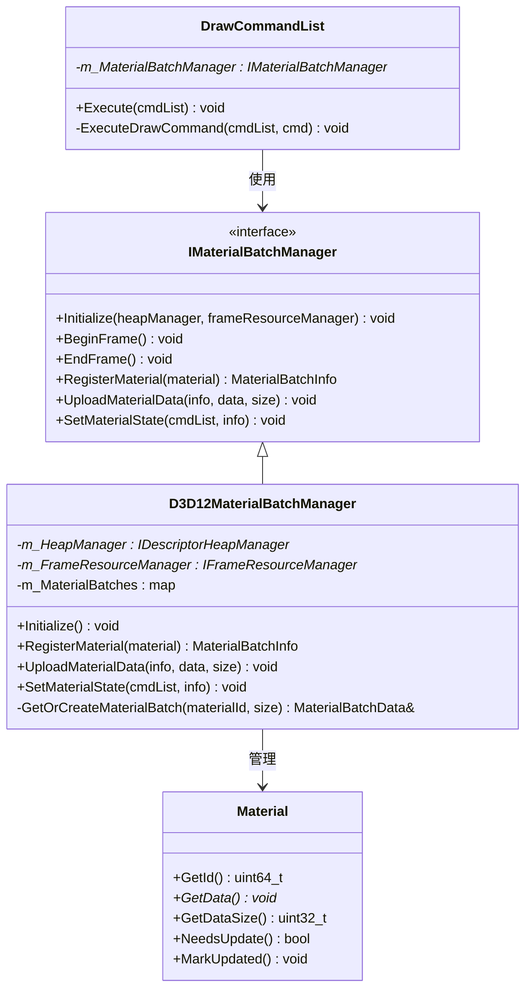
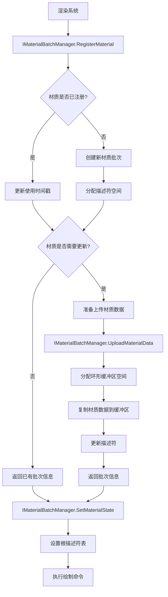

# MaterialBatchManager实现计划

## 一、MaterialBatchManager系统概述

### 1.1 功能职责
MaterialBatchManager是材质批处理管理器，主要负责：
1. 管理材质数据及其GPU资源分配
2. 优化材质状态切换和绑定
3. 为相同材质的对象提供批处理支持
4. 处理材质数据的上传和更新
5. 优化内存使用和减少碎片

### 1.2 设计目标
1. 高效管理大量材质数据
2. 减少状态切换和绑定开销
3. 支持多线程安全访问
4. 实现高效的材质批处理
5. 优化内存使用和帧间缓存
6. 提供平台无关的抽象接口

## 二、MaterialBatchManager设计

### 2.1 材质批处理接口

#### 2.1.1 材质批次信息结构

```cpp
// 材质批次信息
struct MaterialBatchInfo {
    DescriptorHandle descriptorHandle;    // 描述符句柄
    uint32_t constantBufferOffset;        // 常量缓冲区偏移
    uint64_t materialId;                  // 材质唯一ID
    
    bool IsValid() const { return descriptorHandle.IsValid() && materialId != 0; }
};
```

#### 2.1.2 材质批处理管理器接口

```cpp
class IMaterialBatchManager {
public:
    virtual ~IMaterialBatchManager() = default;
    
    // 初始化
    virtual void Initialize(IDescriptorHeapManager* heapManager, IFrameResourceManager* frameResourceManager) = 0;
    
    // 帧管理
    virtual void BeginFrame() = 0;
    virtual void EndFrame() = 0;
    
    // 注册材质
    virtual MaterialBatchInfo RegisterMaterial(const Ref<Material>& material) = 0;
    
    // 上传材质数据
    virtual void UploadMaterialData(const MaterialBatchInfo& info, const void* data, uint32_t size) = 0;
    
    // 设置材质状态
    virtual void SetMaterialState(void* cmdList, const MaterialBatchInfo& info) = 0;
    
    // 高级功能
    virtual void PrecompileMaterialVariants(const Ref<Material>& baseMaterial, 
                                           const std::vector<std::string>& variants) = 0;
    
    // 调试功能
    virtual uint32_t GetTotalMaterialCount() const = 0;
    virtual uint32_t GetActiveFrameMaterialCount() const = 0;
    virtual void DumpStatistics() const = 0;
};
```

### 2.2 DirectX12实现

#### 2.2.1 DirectX12材质批处理管理器

```cpp
class D3D12MaterialBatchManager : public IMaterialBatchManager {
public:
    static D3D12MaterialBatchManager& Get();
    
    // IMaterialBatchManager接口实现
    virtual void Initialize(IDescriptorHeapManager* heapManager, 
                          IFrameResourceManager* frameResourceManager) override;
    virtual void BeginFrame() override;
    virtual void EndFrame() override;
    virtual MaterialBatchInfo RegisterMaterial(const Ref<Material>& material) override;
    virtual void UploadMaterialData(const MaterialBatchInfo& info, 
                                 const void* data, uint32_t size) override;
    virtual void SetMaterialState(void* cmdList, const MaterialBatchInfo& info) override;
    virtual void PrecompileMaterialVariants(const Ref<Material>& baseMaterial, 
                                         const std::vector<std::string>& variants) override;
    virtual uint32_t GetTotalMaterialCount() const override;
    virtual uint32_t GetActiveFrameMaterialCount() const override;
    virtual void DumpStatistics() const override;
    
private:
    // 内部材质数据结构
    struct MaterialBatchData {
        DescriptorAllocation descriptorAllocation;    // 描述符分配
        RingAllocation bufferAllocation;              // 缓冲区分配
        uint64_t frameLastUsed;                       // 上次使用的帧号
        uint32_t materialDataSize;                    // 材质数据大小
        bool needsUpdate;                             // 是否需要更新
    };
    
    IDescriptorHeapManager* m_HeapManager = nullptr;
    IFrameResourceManager* m_FrameResourceManager = nullptr;
    
    // 材质缓存
    std::unordered_map<uint64_t, MaterialBatchData> m_MaterialBatches;
    std::vector<uint64_t> m_ActiveMaterials;          // 当前帧活跃的材质
    
    uint64_t m_CurrentFrame = 0;
    std::mutex m_Mutex;
    
    // 辅助方法
    MaterialBatchData& GetOrCreateMaterialBatch(uint64_t materialId, uint32_t dataSize);
    void UpdateMaterialDescriptor(MaterialBatchData& batchData);
    D3D12_GPU_VIRTUAL_ADDRESS GetMaterialGpuAddress(const MaterialBatchData& batchData) const;
};
```

### 2.3 材质缓存和生命周期管理

```cpp
// 在D3D12MaterialBatchManager中实现
MaterialBatchData& D3D12MaterialBatchManager::GetOrCreateMaterialBatch(uint64_t materialId, uint32_t dataSize) {
    std::lock_guard<std::mutex> lock(m_Mutex);
    
    // 查找现有材质批次
    auto it = m_MaterialBatches.find(materialId);
    if (it != m_MaterialBatches.end()) {
        // 更新使用时间
        it->second.frameLastUsed = m_CurrentFrame;
        
        // 如果大小变化，需要重新分配
        if (it->second.materialDataSize < dataSize) {
            // 释放旧资源
            if (it->second.descriptorAllocation.IsValid()) {
                m_HeapManager->GetAllocator(DescriptorHeapType::CbvSrvUav)
                    .Free(it->second.descriptorAllocation);
            }
            
            // 分配新资源
            it->second.materialDataSize = dataSize;
            it->second.descriptorAllocation = m_HeapManager->GetAllocator(DescriptorHeapType::CbvSrvUav)
                .Allocate(1);
            it->second.needsUpdate = true;
        }
        
        return it->second;
    } else {
        // 创建新的材质批次
        MaterialBatchData newBatch;
        newBatch.frameLastUsed = m_CurrentFrame;
        newBatch.materialDataSize = dataSize;
        newBatch.descriptorAllocation = m_HeapManager->GetAllocator(DescriptorHeapType::CbvSrvUav)
            .Allocate(1);
        newBatch.needsUpdate = true;
        
        auto [iter, inserted] = m_MaterialBatches.insert({materialId, newBatch});
        return iter->second;
    }
}
```

### 2.4 材质数据上传流程

```cpp
void D3D12MaterialBatchManager::UploadMaterialData(const MaterialBatchInfo& info, 
                                               const void* data, uint32_t size) {
    std::lock_guard<std::mutex> lock(m_Mutex);
    
    auto it = m_MaterialBatches.find(info.materialId);
    if (it == m_MaterialBatches.end()) {
        return;  // 材质不存在
    }
    
    auto& batchData = it->second;
    
    // 分配当前帧的环形缓冲区空间
    batchData.bufferAllocation = m_FrameResourceManager->AllocateConstantBuffer(size);
    
    if (!batchData.bufferAllocation.IsValid()) {
        // 分配失败，可能是缓冲区已满
        return;
    }
    
    // 复制数据到缓冲区
    memcpy(
        batchData.bufferAllocation.cpuAddress,
        data,
        size
    );
    
    // 如果需要更新描述符，创建新的CBV
    if (batchData.needsUpdate) {
        UpdateMaterialDescriptor(batchData);
        batchData.needsUpdate = false;
    }
    
    // 添加到当前帧活跃材质列表
    if (std::find(m_ActiveMaterials.begin(), m_ActiveMaterials.end(), info.materialId) 
        == m_ActiveMaterials.end()) {
        m_ActiveMaterials.push_back(info.materialId);
    }
}
```

### 2.5 设置材质状态

```cpp
void D3D12MaterialBatchManager::SetMaterialState(void* cmdList, const MaterialBatchInfo& info) {
    auto d3dCmdList = static_cast<ID3D12GraphicsCommandList*>(cmdList);
    auto it = m_MaterialBatches.find(info.materialId);
    
    if (it == m_MaterialBatches.end()) {
        return;  // 材质不存在
    }
    
    auto& batchData = it->second;
    
    // 设置描述符表，指向材质的常量缓冲区视图
    d3dCmdList->SetGraphicsRootDescriptorTable(
        0,  // 根参数索引，与根签名匹配
        static_cast<D3D12_GPU_DESCRIPTOR_HANDLE>(
            reinterpret_cast<uint64_t>(batchData.descriptorAllocation.baseHandle.gpuHandle)
        )
    );
}
```

## 三、实现步骤

### 3.1 基础结构实现

1. **定义材质批次结构**
   - 实现`MaterialBatchInfo`和`MaterialBatchData`结构
   - 设计材质ID生成和查找机制

2. **创建材质批处理接口**
   - 实现`IMaterialBatchManager`接口
   - 定义与帧资源和描述符系统的交互接口

### 3.2 DirectX12实现

1. **材质批次管理器**
   - 实现`D3D12MaterialBatchManager`类
   - 集成描述符管理和帧资源系统
   - 实现材质缓存和查找

2. **材质数据上传**
   - 实现材质数据的高效上传
   - 适配环形缓冲区管理
   - 处理跨帧材质状态保持

3. **状态设置**
   - 优化材质状态切换
   - 实现根描述符表绑定
   - 处理平台特定细节

### 3.3 批处理优化

1. **材质排序与分组**
   - 实现相似材质的分组
   - 优化状态切换顺序
   - 实现动态实例合并

2. **材质变体**
   - 实现材质变体预编译
   - 支持动态切换材质属性
   - 优化变体共享资源

### 3.4 调试和统计

1. **性能监控**
   - 跟踪材质使用统计
   - 监控状态切换次数
   - 分析内存使用情况

2. **调试可视化**
   - 添加材质批次可视化
   - 实现错误检查和验证
   - 支持性能分析工具

## 四、优化策略

### 4.1 材质分组策略

通过以下几个维度对材质进行分组以减少状态切换：

1. **着色器程序**：相同着色器的材质放在一起
2. **纹理资源**：使用相同纹理的材质批处理
3. **材质参数**：参数相似的材质合并处理
4. **渲染状态**：混合模式、深度测试等状态相同的材质归类

### 4.2 内存管理优化

1. **环形缓冲区管理**：使用多帧环形缓冲防止资源争用
2. **材质数据压缩**：减少大型材质的内存占用
3. **动态内存缩放**：根据负载调整分配大小
4. **冷热数据分离**：频繁使用的材质使用专用内存池

### 4.3 多线程支持

1. **线程安全访问**：使用互斥锁保护共享资源
2. **并行材质上传**：多线程准备材质数据
3. **工作分离**：主线程处理状态设置，工作线程处理上传
4. **任务调度**：大批量材质操作分解为多个任务

## 五、与其他系统的交互

### 5.1 与描述符系统的交互

```cpp
// 初始化时与描述符系统的交互
void D3D12MaterialBatchManager::Initialize(IDescriptorHeapManager* heapManager,
                                       IFrameResourceManager* frameResourceManager) {
    m_HeapManager = heapManager;
    m_FrameResourceManager = frameResourceManager;
    
    // 预分配常用材质空间
    // ...
}

// 更新材质描述符
void D3D12MaterialBatchManager::UpdateMaterialDescriptor(MaterialBatchData& batchData) {
    // 获取当前材质的GPU虚拟地址
    D3D12_GPU_VIRTUAL_ADDRESS cbAddress = GetMaterialGpuAddress(batchData);
    
    // 创建常量缓冲区视图
    D3D12_CONSTANT_BUFFER_VIEW_DESC cbvDesc = {};
    cbvDesc.BufferLocation = cbAddress;
    cbvDesc.SizeInBytes = batchData.materialDataSize;
    
    // 使用描述符系统创建CBV
    auto descriptorHandle = m_HeapManager->CreateView(
        DescriptorType::CBV,
        &cbvDesc,
        nullptr
    );
    
    // 更新材质批次信息中的描述符句柄
    batchData.descriptorAllocation.baseHandle = descriptorHandle;
}
```

### 5.2 与DrawCommand系统的交互

```cpp
// DrawCommandList会调用MaterialBatchManager的方法
class DrawCommandList {
private:
    void ExecuteDrawCommand(ID3D12GraphicsCommandList* cmdList, const DrawCommand& cmd) {
        // 获取材质批次信息
        MaterialBatchInfo batchInfo = m_MaterialBatchManager->RegisterMaterial(cmd.material);
        
        // 上传材质数据（如果需要）
        if (cmd.material->NeedsUpdate()) {
            void* materialData = cmd.material->GetData();
            uint32_t dataSize = cmd.material->GetDataSize();
            
            m_MaterialBatchManager->UploadMaterialData(batchInfo, materialData, dataSize);
            cmd.material->MarkUpdated();
        }
        
        // 设置材质状态
        m_MaterialBatchManager->SetMaterialState(cmdList, batchInfo);
        
        // 执行绘制命令
        // ...
    }
};
```

## 六、MaterialBatchManager架构图



## 七、材质批处理流程图


