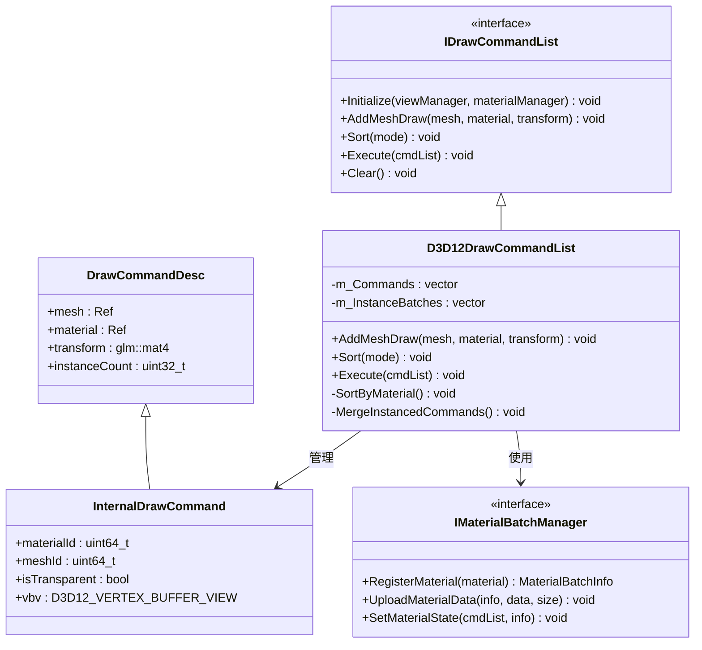
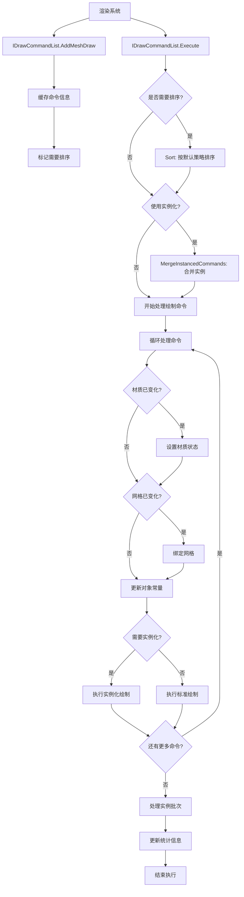

# DrawCommand系统实现计划

## 一、DrawCommand系统概述

### 1.1 功能职责
DrawCommand系统是渲染管线中负责收集、排序和执行绘制命令的组件，主要职责包括：
1. 收集场景中需要渲染的对象
2. 根据材质、深度等对绘制命令进行排序
3. 管理渲染状态切换的开销
4. 执行实际的绘制调用
5. 支持实例化和间接绘制等高级功能

### 1.2 设计目标
1. 最小化渲染状态切换
2. 优化绘制命令排序
3. 支持自动批处理和实例化
4. 提供灵活的排序策略
5. 支持多线程命令构建
6. 平台无关的抽象接口

## 二、DrawCommand系统设计

### 2.1 绘制命令接口

#### 2.1.1 绘制命令结构

```cpp
// 绘制命令描述
struct DrawCommandDesc {
    Ref<Mesh> mesh;                      // 要绘制的网格
    Ref<Material> material;              // 使用的材质
    glm::mat4 transform;                 // 世界变换矩阵
    uint32_t instanceCount = 1;          // 实例数量
    uint32_t indexCount = 0;             // 索引数量（如果为0，使用mesh->GetIndexCount()）
    uint32_t startIndexLocation = 0;     // 起始索引位置
    int32_t baseVertexLocation = 0;      // 基础顶点位置
    uint32_t startInstanceLocation = 0;  // 起始实例位置
    float depth = 0.0f;                  // 用于深度排序
};
```

#### 2.1.2 排序模式枚举

```cpp
// 排序策略枚举
enum class DrawSortMode {
    None,           // 不排序，按添加顺序绘制
    FrontToBack,    // 从前到后排序（用于不透明物体）
    BackToFront,    // 从后到前排序（用于透明物体）
    ByMaterial,     // 按材质ID排序（最小化状态切换）
    ByShader,       // 按着色器排序
    ByMeshThenMaterial, // 先按网格后按材质排序
};
```

#### 2.1.3 绘制命令列表接口

```cpp
class IDrawCommandList {
public:
    virtual ~IDrawCommandList() = default;
    
    // 初始化
    virtual void Initialize(IGfxViewManager* viewManager, IMaterialBatchManager* materialManager) = 0;
    
    // 添加绘制命令
    virtual void AddMeshDraw(const Ref<Mesh>& mesh, const Ref<Material>& material, 
                          const glm::mat4& transform) = 0;
    
    // 带深度的添加（用于透明排序）
    virtual void AddMeshDraw(const Ref<Mesh>& mesh, const Ref<Material>& material, 
                          const glm::mat4& transform, float depth) = 0;
    
    // 批处理支持
    virtual void AddInstancedMeshDraw(const Ref<Mesh>& mesh, const Ref<Material>& material, 
                                  const std::vector<glm::mat4>& transforms) = 0;
    
    // 高级添加方法
    virtual void AddDrawCommand(const DrawCommandDesc& desc) = 0;
    
    // 排序
    virtual void Sort(DrawSortMode mode = DrawSortMode::ByMaterial) = 0;
    
    // 执行
    virtual void Execute(void* cmdList) = 0;
    
    // 管理
    virtual void Clear() = 0;
    virtual size_t GetCommandCount() const = 0;
    
    // 配置
    virtual void SetDefaultSortMode(DrawSortMode mode) = 0;
    virtual void EnableInstancing(bool enable) = 0;
    virtual void EnableMultithreading(bool enable) = 0;
    
    // 统计
    virtual void DumpStatistics() const = 0;
};
```

### 2.2 DirectX12实现

#### 2.2.1 DirectX12绘制命令列表

```cpp
class D3D12DrawCommandList : public IDrawCommandList {
public:
    D3D12DrawCommandList();
    virtual ~D3D12DrawCommandList();
    
    // IDrawCommandList接口实现
    virtual void Initialize(IGfxViewManager* viewManager, IMaterialBatchManager* materialManager) override;
    virtual void AddMeshDraw(const Ref<Mesh>& mesh, const Ref<Material>& material, 
                            const glm::mat4& transform) override;
    virtual void AddMeshDraw(const Ref<Mesh>& mesh, const Ref<Material>& material, 
                            const glm::mat4& transform, float depth) override;
    virtual void AddInstancedMeshDraw(const Ref<Mesh>& mesh, const Ref<Material>& material, 
                                    const std::vector<glm::mat4>& transforms) override;
    virtual void AddDrawCommand(const DrawCommandDesc& desc) override;
    virtual void Sort(DrawSortMode mode = DrawSortMode::ByMaterial) override;
    virtual void Execute(void* cmdList) override;
    virtual void Clear() override;
    virtual size_t GetCommandCount() const override;
    virtual void SetDefaultSortMode(DrawSortMode mode) override;
    virtual void EnableInstancing(bool enable) override;
    virtual void EnableMultithreading(bool enable) override;
    virtual void DumpStatistics() const override;
    
private:
    struct InternalDrawCommand : public DrawCommandDesc {
        uint64_t materialId = 0;         // 缓存的材质ID
        uint64_t meshId = 0;             // 缓存的网格ID
        bool isTransparent = false;      // 是否是透明物体
        D3D12_VERTEX_BUFFER_VIEW vbv;    // 缓存的顶点缓冲区视图
        D3D12_INDEX_BUFFER_VIEW ibv;     // 缓存的索引缓冲区视图
    };
    
    // 实例化批次
    struct InstanceBatch {
        Ref<Mesh> mesh;
        Ref<Material> material;
        std::vector<glm::mat4> transforms;
    };
    
    // 状态和资源
    IGfxViewManager* m_ViewManager = nullptr;
    IMaterialBatchManager* m_MaterialManager = nullptr;
    
    // 命令列表
    std::vector<InternalDrawCommand> m_Commands;
    std::vector<InstanceBatch> m_InstanceBatches;
    
    // 配置
    DrawSortMode m_DefaultSortMode = DrawSortMode::ByMaterial;
    bool m_UseInstancing = true;
    bool m_UseMultithreading = false;
    bool m_IsSorted = false;
    
    // 统计
    struct Statistics {
        uint32_t totalDrawCalls = 0;
        uint32_t batchedDrawCalls = 0;
        uint32_t instancedDrawCalls = 0;
        uint32_t materialSwitches = 0;
        uint32_t meshSwitches = 0;
    } m_Stats;
    
    // 内部方法
    void MergeInstancedCommands();
    void BindMesh(ID3D12GraphicsCommandList* cmdList, const InternalDrawCommand& cmd);
    void SortByMaterial();
    void SortByDepth(bool frontToBack);
    void SortByMeshThenMaterial();
    bool IsMaterialTransparent(const Ref<Material>& material) const;
    void UpdateStatistics(const InternalDrawCommand& prevCmd, const InternalDrawCommand& cmd);
};
```

### 2.3 命令排序算法

```cpp
// 在D3D12DrawCommandList中实现
void D3D12DrawCommandList::Sort(DrawSortMode mode) {
    if (m_Commands.empty()) {
        return;
    }
    
    switch (mode) {
        case DrawSortMode::None:
            // 保持原有顺序
            break;
            
        case DrawSortMode::ByMaterial:
            SortByMaterial();
            break;
            
        case DrawSortMode::FrontToBack:
            SortByDepth(true);
            break;
            
        case DrawSortMode::BackToFront:
            SortByDepth(false);
            break;
            
        case DrawSortMode::ByShader:
            // 按着色器排序
            std::sort(m_Commands.begin(), m_Commands.end(), 
                [](const InternalDrawCommand& a, const InternalDrawCommand& b) {
                    // 先按着色器ID排序
                    uint64_t shaderIdA = a.material->GetShader()->GetID();
                    uint64_t shaderIdB = b.material->GetShader()->GetID();
                    if (shaderIdA != shaderIdB) return shaderIdA < shaderIdB;
                    
                    // 然后按材质ID排序
                    return a.materialId < b.materialId;
                });
            break;
            
        case DrawSortMode::ByMeshThenMaterial:
            SortByMeshThenMaterial();
            break;
    }
    
    m_IsSorted = true;
}

void D3D12DrawCommandList::SortByMaterial() {
    std::sort(m_Commands.begin(), m_Commands.end(), 
        [](const InternalDrawCommand& a, const InternalDrawCommand& b) {
            // 不透明物体和透明物体分组
            if (a.isTransparent != b.isTransparent)
                return a.isTransparent < b.isTransparent;
            
            // 相同透明度类型下按材质排序
            if (a.materialId != b.materialId)
                return a.materialId < b.materialId;
            
            // 相同材质下按网格排序
            if (a.meshId != b.meshId)
                return a.meshId < b.meshId;
            
            // 透明物体内部按深度从后到前排序
            if (a.isTransparent)
                return a.depth > b.depth;
            
            // 不透明物体内部按深度从前到后排序
            return a.depth < b.depth;
        });
}

void D3D12DrawCommandList::SortByDepth(bool frontToBack) {
    std::sort(m_Commands.begin(), m_Commands.end(), 
        [frontToBack](const InternalDrawCommand& a, const InternalDrawCommand& b) {
            if (frontToBack)
                return a.depth < b.depth; // 从前到后
            else
                return a.depth > b.depth; // 从后到前
        });
}

void D3D12DrawCommandList::SortByMeshThenMaterial() {
    std::sort(m_Commands.begin(), m_Commands.end(), 
        [](const InternalDrawCommand& a, const InternalDrawCommand& b) {
            // 首先按网格ID排序
            if (a.meshId != b.meshId)
                return a.meshId < b.meshId;
            
            // 然后按材质ID排序
            return a.materialId < b.materialId;
        });
}
```

### 2.4 实例合并算法

```cpp
void D3D12DrawCommandList::MergeInstancedCommands() {
    if (!m_UseInstancing || m_Commands.size() <= 1) {
        return;
    }
    
    // 按材质和网格分组
    std::unordered_map<uint64_t, std::vector<InternalDrawCommand*>> groups;
    
    for (auto& cmd : m_Commands) {
        // 创建唯一键，组合材质ID和网格ID
        uint64_t key = (cmd.materialId << 32) | cmd.meshId;
        groups[key].push_back(&cmd);
    }
    
    // 清空当前实例批次
    m_InstanceBatches.clear();
    
    // 处理每个组
    for (auto& [key, commands] : groups) {
        // 如果组内命令数量大于1，可以进行实例化
        if (commands.size() > 1) {
            // 创建新的实例批次
            InstanceBatch batch;
            batch.mesh = commands[0]->mesh;
            batch.material = commands[0]->material;
            
            // 收集所有变换矩阵
            batch.transforms.reserve(commands.size());
            for (const auto* cmd : commands) {
                batch.transforms.push_back(cmd->transform);
            }
            
            // 添加到实例批次列表
            m_InstanceBatches.push_back(std::move(batch));
            
            // 标记这些命令已被实例化（稍后可以跳过它们）
            for (auto* cmd : commands) {
                cmd->instanceCount = 0; // 标记为已处理
            }
        }
    }
}
```

### 2.5 执行绘制命令

```cpp
void D3D12DrawCommandList::Execute(void* cmdList) {
    auto d3dCmdList = static_cast<ID3D12GraphicsCommandList*>(cmdList);
    
    // 如果使用实例化并且没有之前处理过，尝试合并实例
    if (m_UseInstancing && m_InstanceBatches.empty()) {
        MergeInstancedCommands();
    }
    
    // 如果没有排序，使用默认排序模式
    if (!m_IsSorted && m_DefaultSortMode != DrawSortMode::None) {
        Sort(m_DefaultSortMode);
    }
    
    // 重置统计
    m_Stats = Statistics{};
    
    // 跟踪当前状态
    InternalDrawCommand prevCmd = {};
    
    // 首先处理常规绘制命令
    for (const auto& cmd : m_Commands) {
        // 跳过已被实例化处理的命令
        if (cmd.instanceCount == 0) {
            continue;
        }
        
        // 更新统计数据
        UpdateStatistics(prevCmd, cmd);
        prevCmd = cmd;
        
        // 材质状态切换
        if (prevCmd.materialId != cmd.materialId || prevCmd.materialId == 0) {
            // 获取材质批次信息
            MaterialBatchInfo batchInfo = m_MaterialManager->RegisterMaterial(cmd.material);
            
            // 上传材质数据（如果需要）
            if (cmd.material->NeedsUpdate()) {
                void* materialData = cmd.material->GetData();
                uint32_t dataSize = cmd.material->GetDataSize();
                
                m_MaterialManager->UploadMaterialData(batchInfo, materialData, dataSize);
                cmd.material->MarkUpdated();
            }
            
            // 设置材质状态
            m_MaterialManager->SetMaterialState(d3dCmdList, batchInfo);
            m_Stats.materialSwitches++;
        }
        
        // 网格状态切换
        if (prevCmd.meshId != cmd.meshId || prevCmd.meshId == 0) {
            BindMesh(d3dCmdList, cmd);
            m_Stats.meshSwitches++;
        }
        
        // 更新每对象常量（如变换矩阵）
        // 可以使用单独的常量缓冲区或推送常量来实现
        // ...
        
        // 执行绘制调用
        if (cmd.instanceCount > 1) {
            d3dCmdList->DrawIndexedInstanced(
                cmd.indexCount > 0 ? cmd.indexCount : cmd.mesh->GetIndexCount(),
                cmd.instanceCount,
                cmd.startIndexLocation,
                cmd.baseVertexLocation,
                cmd.startInstanceLocation
            );
            m_Stats.instancedDrawCalls++;
        } else {
            d3dCmdList->DrawIndexed(
                cmd.indexCount > 0 ? cmd.indexCount : cmd.mesh->GetIndexCount(),
                cmd.startIndexLocation,
                cmd.baseVertexLocation
            );
            m_Stats.totalDrawCalls++;
        }
    }
    
    // 然后处理实例批次
    for (const auto& batch : m_InstanceBatches) {
        // 创建并上传实例数据（变换矩阵）
        // ...
        
        // 设置材质状态
        MaterialBatchInfo batchInfo = m_MaterialManager->RegisterMaterial(batch.material);
        m_MaterialManager->SetMaterialState(d3dCmdList, batchInfo);
        
        // 绑定网格
        // ...
        
        // 执行实例化绘制
        d3dCmdList->DrawIndexedInstanced(
            batch.mesh->GetIndexCount(),
            static_cast<UINT>(batch.transforms.size()),
            0, 0, 0
        );
        
        m_Stats.batchedDrawCalls++;
    }
}
```

## 三、实现步骤

### 3.1 基础结构实现

1. **定义基础数据结构**
   - 实现`DrawCommandDesc`结构
   - 定义`DrawSortMode`枚举
   - 设计内部命令结构

2. **创建命令列表接口**
   - 实现`IDrawCommandList`接口
   - 定义命令管理和执行方法
   - 添加配置和统计接口

### 3.2 DirectX12实现

1. **命令列表管理**
   - 实现`D3D12DrawCommandList`类
   - 实现命令添加和缓存
   - 设计实例批次组织

2. **排序算法**
   - 实现多种排序策略
   - 优化排序算法性能
   - 处理透明物体特殊排序

3. **实例合并**
   - 实现自动实例识别
   - 处理实例数据上传
   - 优化合并算法

### 3.3 执行优化

1. **状态切换优化**
   - 跟踪材质和网格状态
   - 最小化冗余状态设置
   - 实现高效绑定策略

2. **多线程支持**
   - 实现命令并行构建
   - 多线程排序算法
   - 线程安全命令管理

### 3.4 调试和统计

1. **性能统计**
   - 跟踪绘制调用计数
   - 状态切换统计
   - 实例化节省分析

2. **调试支持**
   - 添加命令可视化
   - 提供错误检查
   - 优化问题定位

## 四、优化策略

### 4.1 排序优化

1. **分组排序**：先将命令分为透明和不透明两组，分别使用不同的排序策略
2. **层级排序**：先按着色器，再按材质，再按网格，再按深度排序
3. **按距离分桶**：将场景划分为距离区间，每个区间内单独排序
4. **视锥剔除优化**：与排序结合，提前剔除不可见物体

### 4.2 实例化优化

1. **动态实例识别**：自动识别可实例化的对象
2. **实例缓冲管理**：使用环形缓冲区高效管理实例数据
3. **分组实例化**：小组批处理，避免过大的实例缓冲区
4. **GPU驱动实例化**：使用ExecuteIndirect实现高效实例绘制

### 4.3 间接绘制支持

1. **命令签名设计**：为间接绘制准备命令签名
2. **命令缓冲管理**：创建和管理间接命令缓冲区
3. **GPU剔除集成**：结合GPU视锥剔除
4. **动态LOD支持**：在GPU上计算细节级别

## 五、与其他系统的交互

### 5.1 与描述符系统的交互

```cpp
void D3D12DrawCommandList::Initialize(IGfxViewManager* viewManager, IMaterialBatchManager* materialManager) {
    m_ViewManager = viewManager;
    m_MaterialManager = materialManager;
    
    // 创建常量缓冲资源
    // ...
}

void D3D12DrawCommandList::BindMesh(ID3D12GraphicsCommandList* cmdList, const InternalDrawCommand& cmd) {
    // 绑定顶点缓冲区
    cmdList->IASetVertexBuffers(0, 1, &cmd.vbv);
    
    // 绑定索引缓冲区
    cmdList->IASetIndexBuffer(&cmd.ibv);
    
    // 设置图元类型
    cmdList->IASetPrimitiveTopology(D3D_PRIMITIVE_TOPOLOGY_TRIANGLELIST);
    
    // 可能还需要绑定管线状态对象（PSO）
    // cmd.material->BindPipeline(cmdList);
}
```

### 5.2 与MaterialBatchManager的交互

```cpp
void D3D12DrawCommandList::AddMeshDraw(const Ref<Mesh>& mesh, const Ref<Material>& material, 
                                      const glm::mat4& transform) {
    InternalDrawCommand cmd = {};
    cmd.mesh = mesh;
    cmd.material = material;
    cmd.transform = transform;
    cmd.instanceCount = 1;
    cmd.materialId = material->GetID();
    cmd.meshId = mesh->GetID();
    cmd.isTransparent = IsMaterialTransparent(material);
    
    // 预先缓存顶点和索引缓冲区视图，避免执行时查找
    auto d3dMesh = std::dynamic_pointer_cast<D3D12Mesh>(mesh);
    if (d3dMesh) {
        cmd.vbv = d3dMesh->GetVertexBufferView();
        cmd.ibv = d3dMesh->GetIndexBufferView();
    }
    
    // 计算深度
    if (cmd.isTransparent) {
        // 使用相机方向和位置计算深度
        glm::vec3 position = glm::vec3(transform[3]);
        glm::vec3 cameraPos = m_CurrentCamera ? m_CurrentCamera->GetPosition() : glm::vec3(0.0f);
        cmd.depth = glm::distance(position, cameraPos);
    }
    
    m_Commands.push_back(cmd);
    m_IsSorted = false; // 添加了新命令，需要重新排序
}
```

## 六、DrawCommand架构图



## 七、绘制命令执行流程图

