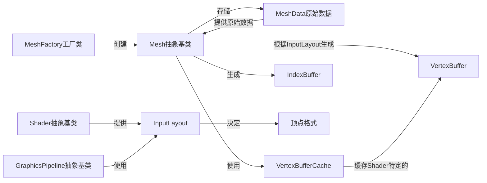

# Mesh系统设计

## 核心组件

### Mesh抽象基类
- 负责管理网格数据和创建渲染所需的顶点/索引缓冲区
- 基于Shader提供的InputLayout动态创建顶点布局
- 不包含固定的顶点格式，而是适应Shader需求

### MeshData原始数据
- 存储从模型文件加载的原始顶点数据
- 包括位置、法线、切线、纹理坐标、颜色等属性
- 仅保存加载的数据，不进行预处理或格式转换

### VertexBufferCache
- 缓存不同Shader对应的顶点缓冲区
- 避免重复创建相同布局的缓冲区
- 使用Shader标识符作为缓存键

### MeshFactory
- 提供创建和加载Mesh的工厂方法
- 支持从各种文件格式加载模型
- 负责解析模型文件并填充MeshData

## 与其他系统的交互

### 与Shader系统
- 接收Shader提供的InputLayout
- 不直接依赖Shader系统，只使用其提供的InputLayout
- 根据InputLayout按需创建顶点缓冲区

### 与缓冲区系统
- 动态创建VertexBuffer和IndexBuffer
- 只包含Shader实际需要的顶点属性
- 优化内存使用和数据传输

### 与图形管线系统
- 提供顶点和索引缓冲区给渲染管线
- 确保顶点数据格式与InputLayout匹配
- 不直接与GraphicsPipeline交互，由渲染上下文协调

## 数据流程
1. 加载Mesh时仅存储原始顶点数据到MeshData中
2. 从Shader系统获取InputLayout
3. 根据InputLayout和MeshData生成顶点缓冲区
4. 缓存生成的缓冲区以提高性能
5. 渲染时提供正确的缓冲区

## 顶点数据处理
```cpp
// 根据Shader的InputLayout创建顶点缓冲区
Ref<VertexBuffer> Mesh::CreateVertexBuffer(const Ref<Shader>& shader)
{
    const BufferLayout& layout = shader->GetInputLayout();
    uint64_t shaderID = shader->GetUID();
    
    // 检查缓存
    if (m_VertexBufferCache.find(shaderID) != m_VertexBufferCache.end())
        return m_VertexBufferCache[shaderID];
    
    // 计算每个顶点的stride
    uint32_t stride = 0;
    for (const auto& element : layout)
        stride += element.Size;
    
    // 创建顶点数据
    std::vector<float> vertexData;
    vertexData.reserve(m_Data.Positions.size() * (stride / sizeof(float)));
    
    // 按照InputLayout填充顶点数据
    for (size_t i = 0; i < m_Data.Positions.size(); i++)
    {
        for (const auto& element : layout)
        {
            if (element.Name == "POSITION")
            {
                vertexData.push_back(m_Data.Positions[i].x);
                vertexData.push_back(m_Data.Positions[i].y);
                vertexData.push_back(m_Data.Positions[i].z);
            }
            else if (element.Name == "NORMAL" && m_Data.HasNormals)
            {
                vertexData.push_back(m_Data.Normals[i].x);
                vertexData.push_back(m_Data.Normals[i].y);
                vertexData.push_back(m_Data.Normals[i].z);
            }
            // 处理其他属性...
            else if (element.Name == "COLOR")
            {
                if (m_Data.HasColors)
                {
                    vertexData.push_back(m_Data.Colors[i].r);
                    vertexData.push_back(m_Data.Colors[i].g);
                    vertexData.push_back(m_Data.Colors[i].b);
                    vertexData.push_back(m_Data.Colors[i].a);
                }
                else
                {
                    // 如果shader需要color但mesh没有，提供默认值
                    vertexData.push_back(1.0f); // r
                    vertexData.push_back(1.0f); // g
                    vertexData.push_back(1.0f); // b
                    vertexData.push_back(1.0f); // a
                }
            }
        }
    }
    
    // 创建顶点缓冲区
    Ref<VertexBuffer> vertexBuffer = VertexBuffer::Create(
        vertexData.data(), 
        vertexData.size() * sizeof(float), 
        stride
    );
    
    // 缓存并返回
    m_VertexBufferCache[shaderID] = vertexBuffer;
    return vertexBuffer;
}
</code_block_to_apply_changes_from> 