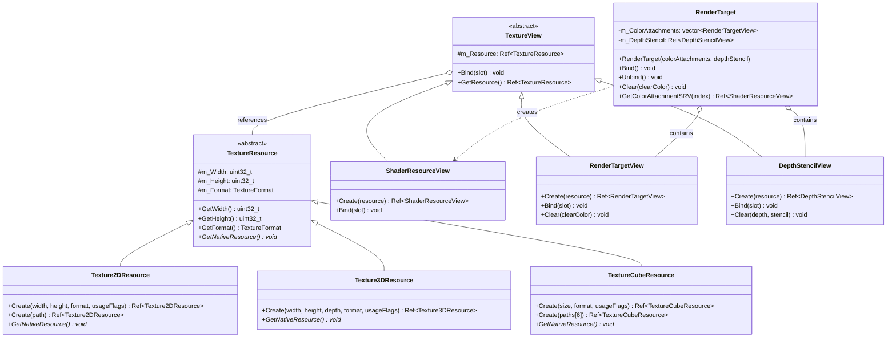
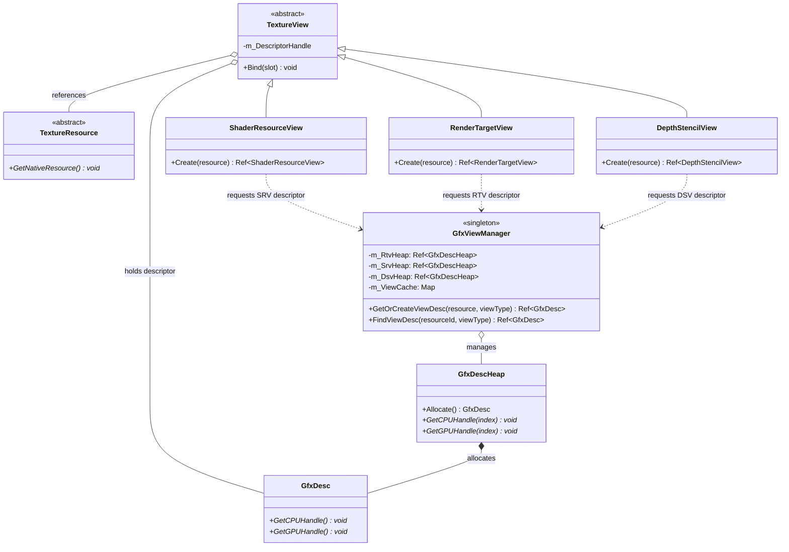

# 纹理资源架构

上图展示了我们设计的纹理资源架构，采用"资源+视图"的模式。这种设计将纹理系统分为两个核心概念：

## 资源类

- **TextureResource**: 抽象基类，表示GPU上的内存资源
  - **Texture2DResource**: 2D纹理实现
  - **Texture3DResource**: 3D纹理实现
  - **TextureCubeResource**: 立方体贴图实现

## 视图类

- **TextureView**: 抽象基类，定义资源的使用方式
  - **ShaderResourceView**: 用于着色器读取纹理
  - **RenderTargetView**: 用于作为渲染目标
  - **DepthStencilView**: 用于深度/模板测试

## 高级抽象

- **RenderTarget**: 高级类，组合多个视图，简化渲染目标操作

这种设计的优势在于：
1. 符合现代图形API的资源管理模型
2. 支持资源复用（同一纹理可用于不同目的）
3. 职责分离明确
4. 提供类型安全的API

## TextureView与GfxViewManager的关系

TextureView与GfxViewManager之间存在关键的协作关系：

1. **视图创建过程**
   - 当创建一个新的视图（如ShaderResourceView）时，该视图需要向GfxViewManager请求一个合适的描述符
   - GfxViewManager根据资源和视图类型在对应的描述符堆中分配描述符空间
   - 视图存储获得的描述符句柄，以便后续绑定操作使用

2. **描述符管理**
   - GfxViewManager负责管理各类描述符堆（SRV、RTV、DSV等）
   - 使用资源ID+视图类型作为键，缓存已创建的描述符避免重复创建
   - 处理描述符的生命周期管理

3. **接口协调**
   - 视图对象提供高级抽象API（Bind、Clear等）
   - GfxViewManager提供底层描述符管理功能
   - 两者配合实现资源到GPU管线的绑定

这种设计充分利用了现代图形API（特别是D3D12）的描述符模型，同时通过抽象层次保持了代码的可维护性。
