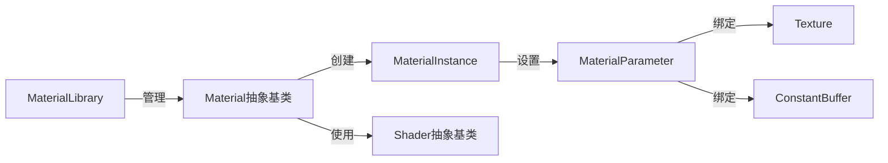

# 材质系统设计

## 核心组件

### Material抽象基类
- 定义材质的基本属性和行为
- 持有对Shader的引用
- 提供参数设置的接口
- 管理材质实例的创建

### MaterialInstance
- 代表Material的一个具体实例
- 可以覆盖材质的默认参数
- 允许同一材质创建多个变体
- 维护自身的参数状态

### MaterialParameter
- 表示材质中的可调参数
- 支持多种类型（标量、向量、矩阵、纹理等）
- 保存参数的名称、类型和当前值

### MaterialLibrary
- 管理已加载的材质资源
- 提供材质查找和缓存功能
- 支持热重载和资源优化

## 与其他系统的关系

### 与Shader系统的关系
- 材质系统基于Shader系统创建材质
- Material持有对Shader的引用
- 从Shader反射中获取可用参数信息
- 管理Shader参数的设置和更新

### 与资源系统的关系
- 绑定纹理和常量缓冲区等资源
- 将参数值更新到底层图形API
- 跟踪和管理资源的生命周期

### 与渲染上下文的关系
- 渲染时提供必要的材质状态
- 确保正确的资源绑定
- 支持不同渲染队列和渲染策略

## 实现细节

### 材质系统工作流程
1. 创建基础Material，关联特定Shader
2. 通过Shader反射获取可用参数
3. 设置材质默认参数值
4. 创建MaterialInstance，可选择性覆盖默认参数
5. 渲染时使用MaterialInstance设置所需资源和状态

### 材质参数管理
1. 根据Shader反射自动发现参数
2. 支持向量、矩阵、纹理等多种类型
3. 提供类型安全的参数设置API
4. 高效地将参数值更新到GPU

### 示例代码结构
```cpp
// 材质基类
class Material {
public:
    Material(const Ref<Shader>& shader)
        : m_Shader(shader)
    {
        // 从shader反射获取参数信息
        auto parameters = shader->GetReflection()->GetParameters();
        for (auto& param : parameters) {
            m_Parameters[param.GetName()] = MaterialParameter(param);
        }
    }
    
    // 创建材质实例
    Ref<MaterialInstance> CreateInstance() {
        return std::make_shared<MaterialInstance>(this);
    }
    
    // 获取shader
    Ref<Shader> GetShader() const { return m_Shader; }
    
    // 设置默认参数
    template<typename T>
    void SetParameter(const std::string& name, const T& value) {
        if (m_Parameters.find(name) != m_Parameters.end()) {
            m_Parameters[name].SetValue(value);
        }
    }
    
private:
    Ref<Shader> m_Shader;
    std::unordered_map<std::string, MaterialParameter> m_Parameters;
    friend class MaterialInstance;
};

// 材质实例
class MaterialInstance {
public:
    MaterialInstance(Material* parent)
        : m_Parent(parent)
    {
        // 拷贝父材质的参数作为默认值
        m_OverriddenParameters = m_Parent->m_Parameters;
    }
    
    // 覆盖参数
    template<typename T>
    void SetParameter(const std::string& name, const T& value) {
        if (m_OverriddenParameters.find(name) != m_OverriddenParameters.end()) {
            m_OverriddenParameters[name].SetValue(value);
        }
    }
    
    // 应用材质（绑定资源等）
    void Apply(const Ref<RenderContext>& context) {
        // 绑定shader
        m_Parent->m_Shader->Bind();
        
        // 应用所有参数
        for (auto& [name, param] : m_OverriddenParameters) {
            param.Apply(context);
        }
    }
    
private:
    Material* m_Parent;
    std::unordered_map<std::string, MaterialParameter> m_OverriddenParameters;
};
```

## 材质系统优势

### 灵活性
- 支持复杂的材质层级和继承
- 允许基于基础材质创建多个变体
- 简化材质参数的管理和更新

### 性能
- 高效管理大量材质实例
- 减少状态切换和冗余更新
- 支持材质排序和批处理

### 可扩展性
- 容易添加新的材质类型和效果
- 支持自定义材质系统和渲染技术
- 易于集成到现有渲染管线 