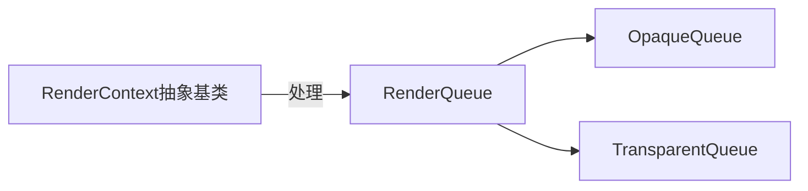

```mermaid
graph LR;
    %% 渲染上下文模块
    RenderContext[RenderContext抽象基类]
    RenderQueue[RenderQueue]
    OpaqueQueue[OpaqueQueue]
    TransparentQueue[TransparentQueue]
    
    %% 内部关系
    RenderContext -- 处理 --> RenderQueue
    RenderQueue --> OpaqueQueue
    RenderQueue --> TransparentQueue
``` 