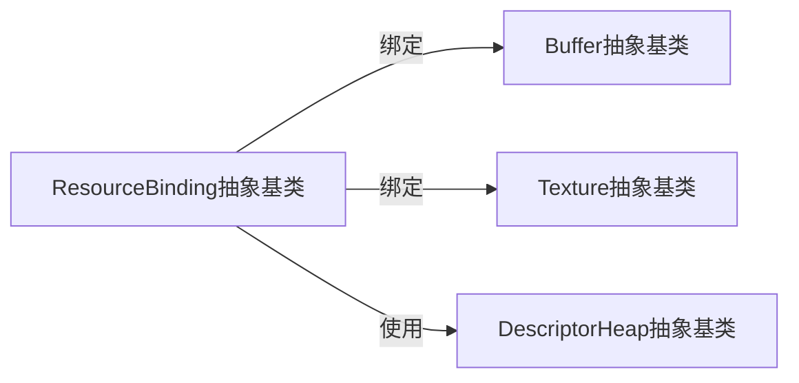

```mermaid
graph LR;
    %% 资源系统模块
    Buffer[Buffer抽象基类]
    Texture[Texture抽象基类]
    ResourceBinding[ResourceBinding抽象基类]
    DescriptorHeap[DescriptorHeap抽象基类]
    
    %% 内部关系
    ResourceBinding -- 绑定 --> Buffer
    ResourceBinding -- 绑定 --> Texture
    ResourceBinding -- 使用 --> DescriptorHeap
``` 