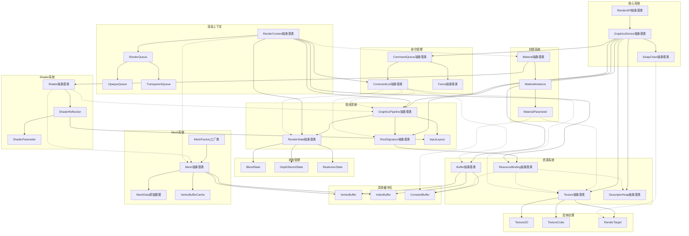

# RHI层架构图

## 核心系统
[核心系统模块](RHI_核心系统.md)

## 命令管理
[命令管理模块](RHI_命令管理.md)

## 管线系统
[管线系统模块](RHI_管线系统.md)

## 状态管理
[状态管理模块](RHI_状态管理.md)

## 资源系统
[资源系统模块](RHI_资源系统.md)

## 具体缓冲区
[具体缓冲区模块](RHI_具体缓冲区.md)

## 具体纹理
[具体纹理模块](RHI_具体纹理.md)

## 渲染上下文
[渲染上下文模块](RHI_渲染上下文.md)

## Mesh系统
[Mesh系统模块](RHI_Mesh系统.md)

## Shader系统
[Shader系统模块](RHI_Shader反射系统.md)

## 材质系统
[材质系统模块](RHI_材质系统.md)

## 完整架构图

## 连线优化说明

为提高架构图的可读性，主要进行了以下优化：

1. **简化连线**：
   - 使用组合语法（如`A --> B & C & D`）减少连线数量
   - 将类似关系的连线合并
   - 使用实线表示核心/主要关系，虚线表示次要关系

2. **连线设计**：
   - 从上到下的流向，减少交叉连线
   - 系统内部关系用实线，系统间关系大多用虚线
   - 将相关节点放在一起，缩短连线距离

3. **突出重点**：
   - 继承关系和核心系统关系清晰显示
   - 跨系统交互使用不同样式区分
   - 渲染上下文的协调作用通过连线模式体现