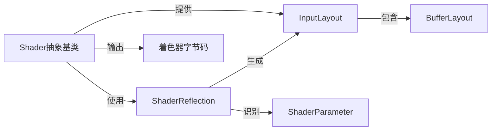

# Shader系统设计

## 核心组件

### Shader抽象基类
- 加载、编译和管理着色器代码
- 持有平台无关的着色器抽象
- 提供编译后的着色器代码给管线系统
- 通过反射机制提供InputLayout给Mesh系统和管线系统

### ShaderReflection
- 分析着色器字节码或HLSL/GLSL源码
- 提取顶点输入布局、常量缓冲区结构和资源绑定点
- 支持跨平台的反射功能 (D3D12/Vulkan/OpenGL)

### InputLayout
- 定义顶点数据的内存布局
- 包含顶点属性的类型、大小、偏移和语义
- 由反射系统根据着色器输入自动生成
- 作为桥梁连接Shader系统、Mesh系统和管线系统

### BufferLayout
- 描述特定缓冲区的内存布局
- 定义缓冲区中各个元素的类型和排列
- 计算元素大小、偏移和总步幅

### ShaderParameter
- 表示着色器中的常量参数
- 跟踪参数的类型、大小和绑定点
- 支持着色器资源视图的反射

## 与其他系统的关系

### 与管线系统的关系
- 提供编译后的着色器代码给GraphicsPipeline
- 提供InputLayout给GraphicsPipeline作为顶点数据格式配置
- 管线系统不直接管理Shader，只使用Shader的结果

### 与Mesh系统的关系
- 提供InputLayout给Mesh系统用于创建顶点缓冲区
- Mesh系统根据Shader的InputLayout按需创建顶点数据
- 通过这种方式实现数据驱动的渲染资源创建

### 与材质系统的关系
- 为材质系统提供底层的着色器支持
- 材质系统基于Shader创建不同的材质配置
- 材质系统管理Shader参数的设置和资源绑定

## 实现细节

### Shader反射过程
1. 加载着色器字节码或源代码
2. 使用平台特定的反射API解析着色器
3. 提取顶点输入布局信息
4. 识别常量缓冲区和资源绑定
5. 生成平台无关的描述结构

### InputLayout生成
1. 分析着色器输入签名
2. 识别所需的顶点属性 (位置、法线、纹理坐标等)
3. 生成BufferLayout描述
4. 将BufferLayout提供给Mesh系统和管线系统

### 示例代码结构
```cpp
// 反射API抽象
class ShaderReflection {
public:
    virtual ~ShaderReflection() = default;
    virtual BufferLayout ReflectVertexInputLayout() = 0;
    virtual std::vector<ShaderParameter> ReflectParameters() = 0;
    virtual std::vector<ResourceBinding> ReflectResourceBindings() = 0;
};

// 平台特定实现
class D3D12ShaderReflection : public ShaderReflection {
public:
    D3D12ShaderReflection(const std::vector<uint8_t>& shaderBytecode);
    BufferLayout ReflectVertexInputLayout() override;
    std::vector<ShaderParameter> ReflectParameters() override;
    std::vector<ResourceBinding> ReflectResourceBindings() override;
};

// Shader类实现
class Shader {
public:
    // 初始化时执行反射
    Shader(const std::string& filepath) {
        // 加载和编译着色器
        m_Reflection = CreateReflection();
        m_InputLayout = m_Reflection->ReflectVertexInputLayout();
        m_Parameters = m_Reflection->ReflectParameters();
        m_ResourceBindings = m_Reflection->ReflectResourceBindings();
    }
    
    // 获取反射生成的顶点输入布局
    const BufferLayout& GetInputLayout() const { return m_InputLayout; }
    
    // 获取编译后的着色器字节码
    const std::vector<uint8_t>& GetByteCode() const { return m_ByteCode; }
    
private:
    std::vector<uint8_t> m_ByteCode;
    std::unique_ptr<ShaderReflection> m_Reflection;
    BufferLayout m_InputLayout;
    std::vector<ShaderParameter> m_Parameters;
    std::vector<ResourceBinding> m_ResourceBindings;
};
```

## 数据流程
1. Shader加载并编译
2. Shader执行反射，生成InputLayout和参数信息
3. Shader将InputLayout提供给Mesh系统和管线系统
4. Shader将编译后的字节码提供给管线系统
5. 管线系统使用字节码和InputLayout创建管线状态
6. Mesh系统使用InputLayout创建顶点缓冲区 