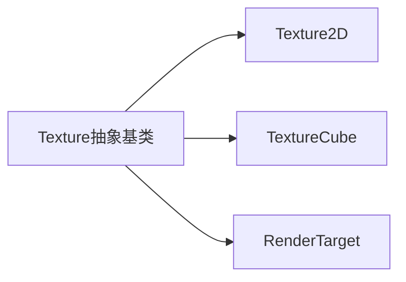

```mermaid
graph LR;
    %% 具体纹理模块
    Texture[Texture抽象基类]
    Texture2D[Texture2D]
    TextureCube[TextureCube]
    RenderTarget[RenderTarget]
    
    %% 内部关系
    Texture --> Texture2D
    Texture --> TextureCube
    Texture --> RenderTarget
``` 