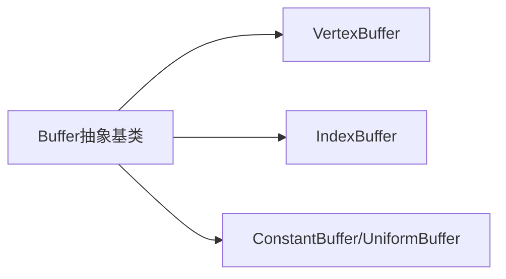

```mermaid
graph LR;
    %% 具体缓冲区模块
    Buffer[Buffer抽象基类]
    VertexBuffer[VertexBuffer]
    IndexBuffer[IndexBuffer]
    ConstantBuffer[ConstantBuffer/UniformBuffer]
    
    %% 内部关系
    Buffer --> VertexBuffer
    Buffer --> IndexBuffer
    Buffer --> ConstantBuffer
``` 