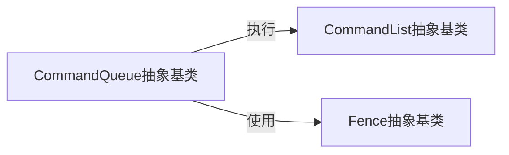

```mermaid
graph LR;
    %% 命令管理模块
    CommandQueue[CommandQueue抽象基类]
    CommandList[CommandList抽象基类]
    Fence[Fence抽象基类]
    
    %% 内部关系
    CommandQueue -- 执行 --> CommandList
    CommandQueue -- 使用 --> Fence
``` 