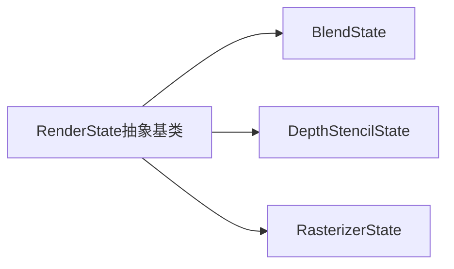

```mermaid
graph LR;
    %% 状态管理模块
    RenderState[RenderState抽象基类]
    BlendState[BlendState]
    DepthStencilState[DepthStencilState]
    RasterizerState[RasterizerState]
    
    %% 内部关系
    RenderState --> BlendState
    RenderState --> DepthStencilState
    RenderState --> RasterizerState
``` 