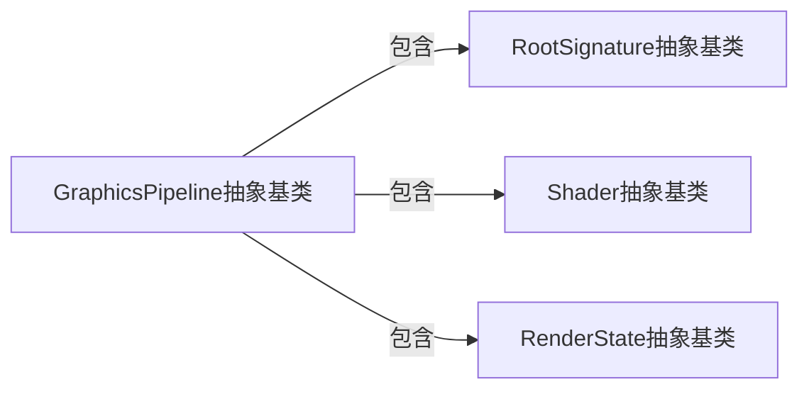

```mermaid
graph LR;
    %% 管线系统模块
    GraphicsPipeline[GraphicsPipeline抽象基类]
    RootSignature[RootSignature抽象基类]
    Shader[Shader抽象基类]
    RenderState[RenderState抽象基类]
    
    %% 内部关系
    GraphicsPipeline -- 包含 --> RootSignature
    GraphicsPipeline -- 包含 --> Shader
    GraphicsPipeline -- 包含 --> RenderState
``` 