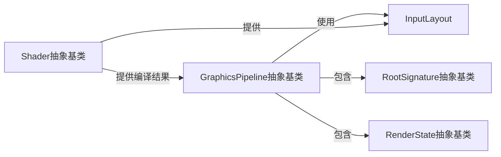

# 管线系统组件设计

## GraphicsPipeline抽象基类
- 定义图形渲染管线的创建和管理接口
- 整合所有渲染所需的核心组件
- 提供管线状态对象的统一抽象
- 使用外部Shader提供的编译结果和InputLayout

## RootSignature抽象基类
- 定义着色器资源布局
- 管理描述符表格和根常量
- 提供API无关的资源绑定抽象

## RenderState抽象基类
- 管理渲染状态配置
- 包含混合、深度模板和光栅化等状态

## InputLayout
- 定义顶点数据的布局和格式
- 由外部Shader系统的反射功能生成
- 由GraphicsPipeline使用来配置顶点数据格式
- 与Mesh系统结合，指导顶点缓冲区的创建

## 与Shader系统的关系
- 管线系统不负责Shader的编译和管理
- 接收由Shader系统提供的编译后的着色器代码
- 使用Shader反射系统生成的InputLayout
- 根据Shader需求配置管线状态 